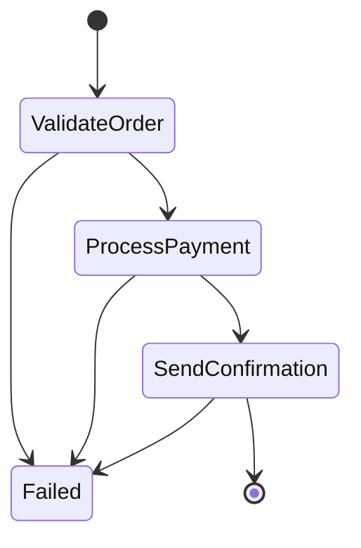
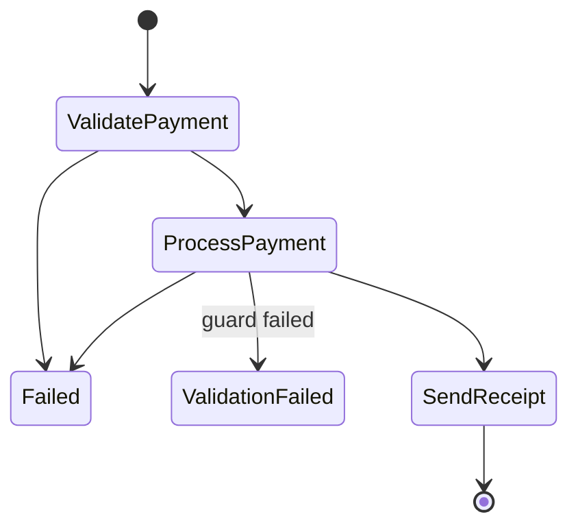
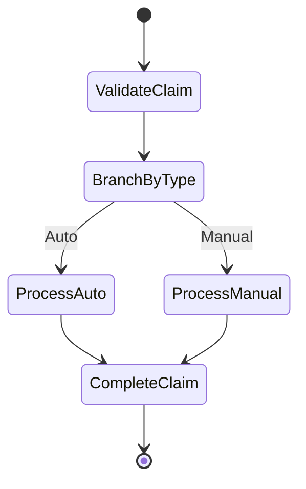

# Strategos Implementation Roadmap

**Status:** Milestone 11 Complete - 79% Design Document Coverage
**Created:** 2025-11-30
**Last Updated:** 2025-12-01
**Reference:** [Design Document](../design.md)

---

## Overview

This document captures the complete implementation roadmap for the Strategos library - a fluent DSL for deterministic agentic workflow orchestration with source-generated state machines.

## Project Structure

```
src/
├── Strategos/                         # Runtime library
│   ├── Strategos.csproj
│   ├── GlobalUsings.cs
│   ├── Abstractions/                         # Core contracts
│   │   ├── IWorkflowState.cs                 # Base state interface
│   │   ├── IWorkflowStep.cs                  # Step execution contract
│   │   ├── IWorkflowBuilder.cs               # Fluent builder interface
│   │   ├── IBranchBuilder.cs                 # Branch path builder
│   │   ├── IStepConfiguration.cs             # Step config options
│   │   ├── IApprovalConfiguration.cs         # Approval config
│   │   ├── IContextAssemblyBuilder.cs        # Context assembly for agent steps
│   │   ├── IGraphBuilder.cs                  # Escape hatch to graph API
│   │   ├── IArtifactStore.cs                 # Claim-check pattern ✅ NEW
│   │   └── IStepExecutionLedger.cs           # Memoization contract ✅ NEW
│   ├── Attributes/                           # Marker attributes for generator
│   │   ├── WorkflowAttribute.cs              # [Workflow("name")]
│   │   ├── WorkflowStateAttribute.cs         # [WorkflowState]
│   │   ├── AppendAttribute.cs                # Collection append reducer
│   │   └── MergeAttribute.cs                 # Dictionary merge reducer
│   ├── Builders/                             # Fluent DSL implementation
│   │   ├── WorkflowBuilder.cs                # Main builder
│   │   ├── BranchBuilder.cs                  # Branch path builder
│   │   ├── StepConfiguration.cs              # Step config impl
│   │   ├── ApprovalConfiguration.cs          # Approval config impl
│   │   └── ContextAssemblyBuilder.cs         # Context assembly impl
│   ├── Definitions/                          # Intermediate model (IR)
│   │   ├── WorkflowDefinition.cs             # Complete workflow IR
│   │   ├── StepDefinition.cs                 # Step IR
│   │   ├── TransitionDefinition.cs           # Transition IR
│   │   ├── BranchPointDefinition.cs          # Branch point IR
│   │   ├── BranchCase.cs                     # Branch case record
│   │   └── WorkflowMetadata.cs               # Metadata for generation
│   ├── Steps/                                # Step base classes
│   │   ├── WorkflowStep.cs                   # Base for DI-injected steps
│   │   ├── AgentStep.cs                      # Base for LLM agent steps
│   │   ├── StepResult.cs                     # Step execution result
│   │   └── StepContext.cs                    # Execution context
│   ├── Validation/                           # Validation types
│   │   ├── StepValidationResult.cs           # Step validation outcome
│   │   ├── WorkflowValidationResult.cs       # Workflow validation outcome
│   │   └── WorkflowValidationError.cs        # Validation error detail
│   ├── Configuration/                        # Agent configuration
│   │   └── AgentConfig.cs                    # Agent step config
│   └── Extensions/                           # DI extensions
│       └── ServiceCollectionExtensions.cs    # DI registration
│
├── Strategos.Generators/              # Source generator (netstandard2.0)
│   ├── Strategos.Generators.csproj
│   ├── WorkflowIncrementalGenerator.cs       # Main IIncrementalGenerator for [Workflow]
│   ├── StateReducerIncrementalGenerator.cs   # IIncrementalGenerator for [WorkflowState] ✅
│   ├── FluentDslParser.cs                    # Parse DSL method chains + state type extraction ✅
│   ├── Models/
│   │   ├── WorkflowModel.cs                  # Workflow generator IR (with Loops, Branches) ✅
│   │   ├── StepModel.cs                      # Step type info for DI registration ✅
│   │   ├── LoopModel.cs                      # Loop construct model ✅ NEW
│   │   ├── BranchModel.cs                    # Branch construct model (with BranchCaseModel) ✅ NEW
│   │   ├── StateModel.cs                     # State reducer generator IR ✅
│   │   ├── StatePropertyModel.cs             # Property model for reducers ✅
│   │   └── StatePropertyKind.cs              # Property semantics enum ✅
│   ├── Emitters/
│   │   ├── PhaseEnumEmitter.cs               # Phase enum generation
│   │   ├── CommandsEmitter.cs                # Wolverine commands (Message Tripling) ✅
│   │   ├── EventsEmitter.cs                  # Marten events ✅
│   │   ├── TransitionsEmitter.cs             # Transition table ✅
│   │   ├── StateReducerEmitter.cs            # State reducer class generation ✅
│   │   ├── SagaEmitter.cs                    # Wolverine saga (Brain & Muscle pattern) ✅
│   │   ├── WorkerHandlerEmitter.cs           # Step worker handlers (Muscle) ✅
│   │   ├── ExtensionsEmitter.cs              # DI registration extensions ✅
│   │   └── MermaidEmitter.cs                 # Mermaid state diagram generation ✅ NEW
│   ├── Diagnostics/
│   │   ├── WorkflowDiagnostics.cs            # Workflow diagnostic descriptors
│   │   └── StateReducerDiagnostics.cs        # State reducer diagnostics (AGSR001/002) ✅
│   └── Polyfills/
│       └── IsExternalInit.cs                 # netstandard2.0 polyfill
│
├── Strategos.Tests/                   # Unit tests (265 tests)
│   ├── Strategos.Tests.csproj
│   ├── GlobalUsings.cs
│   ├── Abstractions/
│   │   ├── IWorkflowStateTests.cs
│   │   ├── IWorkflowStepTests.cs
│   │   ├── IArtifactStoreTests.cs            # ✅ NEW - 9 tests
│   │   └── IStepExecutionLedgerTests.cs      # ✅ NEW - 9 tests
│   ├── Attributes/                           # ✅ New attribute tests
│   │   ├── WorkflowStateAttributeTests.cs
│   │   ├── AppendAttributeTests.cs
│   │   └── MergeAttributeTests.cs
│   ├── Builders/
│   │   ├── WorkflowBuilderTests.cs
│   │   └── BranchBuilderTests.cs
│   ├── Definitions/
│   │   ├── StepDefinitionTests.cs
│   │   ├── WorkflowDefinitionTests.cs
│   │   └── TransitionDefinitionTests.cs
│   ├── Steps/
│   │   ├── StepResultTests.cs
│   │   └── StepContextTests.cs
│   └── Fixtures/
│       ├── TestWorkflowState.cs
│       └── TestSteps.cs
│
└── Strategos.Generators.Tests/        # Generator tests (377 tests)
    ├── Strategos.Generators.Tests.csproj
    ├── GeneratorIntegrationTests.cs
    ├── FluentDslParserTests.cs                   # ✅ Extended for loop/branch extraction (8c)
    ├── DiagnosticTests.cs
    ├── StateReducerGeneratorIntegrationTests.cs  # ✅ State reducer generator tests
    ├── StateReducerDiagnosticTests.cs            # ✅ Diagnostic tests
    ├── SagaEmitterIntegrationTests.cs            # ✅ Extended for loop/branch handlers (8c)
    ├── WorkerHandlerIntegrationTests.cs          # ✅ Worker handler tests
    ├── ExtensionsIntegrationTests.cs             # ✅ DI extensions tests
    ├── Models/
    │   ├── StateModelTests.cs                    # ✅ Model unit tests
    │   ├── StepModelTests.cs                     # ✅ Step model tests
    │   └── WorkflowModelTests.cs                 # ✅ Extended for Loops/Branches (8c)
    ├── Emitters/
    │   ├── PhaseEnumEmitterUnitTests.cs
    │   ├── CommandsEmitterUnitTests.cs           # ✅ Extended for Message Tripling
    │   ├── EventsEmitterUnitTests.cs
    │   ├── TransitionsEmitterUnitTests.cs
    │   ├── StateReducerEmitterUnitTests.cs       # ✅ Emitter unit tests
    │   ├── WorkerHandlerEmitterUnitTests.cs      # ✅ Worker handler emitter tests
    │   ├── ExtensionsEmitterUnitTests.cs         # ✅ Extensions emitter tests
    │   └── MermaidEmitterUnitTests.cs            # ✅ Mermaid diagram tests (19 tests) NEW
    └── Fixtures/
        ├── GeneratorTestHelper.cs
        ├── ParserTestHelper.cs                   # ✅ Extended for loop/branch extraction (8c)
        └── SourceTexts.cs                        # ✅ Extended with loop/branch workflows (8c)
```

---

## Implementation Milestones

### Milestone 1: Core Data Models ✅

**Status:** Complete
**Goal:** Establish foundational type system

#### Iteration 1: StepDefinition
- **Tests:**
  - `Create_WithStepType_CapturesTypeName`
  - `Create_WithStepType_DerivesPhaseName`
  - `Create_WithCustomName_UsesCustomName`
  - `Create_WithNullType_ThrowsArgumentNullException`
  - `StepDefinition_IsImmutableRecord`
- **Implementation:**
  ```csharp
  public sealed record StepDefinition
  {
      public required string StepId { get; init; }
      public required string StepName { get; init; }
      public required Type StepType { get; init; }
      public string StepTypeName => StepType.Name;
      public bool IsTerminal { get; init; }

      public static StepDefinition Create(Type stepType, string? customName = null);
  }
  ```

#### Iteration 2: WorkflowDefinition
- **Tests:**
  - `Create_WithName_ReturnsEmptyDefinition`
  - `Create_WithNullName_ThrowsArgumentException`
  - `WithStep_AppendsStep_PreservesImmutability`
  - `WithEntryStep_SetsEntryStep`
  - `WithTerminalStep_SetsTerminalStep`
- **Implementation:**
  ```csharp
  public sealed record WorkflowDefinition<TState> where TState : class, IWorkflowState
  {
      public required string Name { get; init; }
      public IReadOnlyList<StepDefinition> Steps { get; init; } = [];
      public IReadOnlyList<TransitionDefinition> Transitions { get; init; } = [];
      public StepDefinition? EntryStep { get; init; }
      public StepDefinition? TerminalStep { get; init; }

      public static WorkflowDefinition<TState> Create(string name);
      public WorkflowDefinition<TState> WithStep(StepDefinition step);
  }
  ```

#### Iteration 3: StepResult
- **Tests:**
  - `FromState_WithState_CreatesResult`
  - `WithConfidence_SetsConfidenceScore`
  - `WithMetadata_SetsMetadata`
  - `StepResult_IsImmutableRecord`
- **Implementation:**
  ```csharp
  public sealed record StepResult<TState>(
      TState UpdatedState,
      double? Confidence = null,
      IReadOnlyDictionary<string, object>? Metadata = null)
      where TState : class, IWorkflowState
  {
      public static StepResult<TState> FromState(TState state);
      public static StepResult<TState> WithConfidence(TState state, double confidence);
  }
  ```

#### Iteration 4: StepContext
- **Tests:**
  - `StepContext_RequiresCorrelationId`
  - `StepContext_RequiresWorkflowId`
  - `StepContext_RequiresStepName`
  - `StepContext_RequiresTimestamp`
  - `StepContext_IsImmutableRecord`
- **Implementation:**
  ```csharp
  public sealed record StepContext
  {
      public required string CorrelationId { get; init; }
      public required Guid WorkflowId { get; init; }
      public required string StepName { get; init; }
      public required DateTimeOffset Timestamp { get; init; }
      public required string CurrentPhase { get; init; }
      public int RetryCount { get; init; }
  }
  ```

#### Iteration 5: IWorkflowState & IWorkflowStep
- **Tests:**
  - `IWorkflowState_RequiresWorkflowIdProperty`
  - `IWorkflowStep_ExecuteAsync_ReturnsStepResult`
  - `TestWorkflowState_ImplementsIWorkflowState`
- **Implementation:**
  ```csharp
  public interface IWorkflowState
  {
      Guid WorkflowId { get; }
  }

  public interface IWorkflowStep<TState> where TState : class, IWorkflowState
  {
      Task<StepResult<TState>> ExecuteAsync(
          TState state, StepContext context, CancellationToken ct);
  }
  ```

---

### Milestone 2: Fluent DSL Builder ✅

**Status:** Complete
**Goal:** Enable workflow definition via fluent API

#### Iteration 6: Workflow<T>.Create()
- **Tests:**
  - `Create_WithValidName_ReturnsWorkflowBuilder`
  - `Create_WithNullName_ThrowsArgumentNullException`
  - `Create_WithEmptyName_ThrowsArgumentException`
- **Implementation:**
  ```csharp
  public static class Workflow<TState> where TState : class, IWorkflowState, new()
  {
      public static IWorkflowBuilder<TState> Create(string name);
  }
  ```

#### Iteration 7: StartWith<TStep>()
- **Tests:**
  - `StartWith_WithStepType_SetsEntryStep`
  - `StartWith_CalledTwice_ThrowsInvalidOperationException`
  - `StartWith_AddsStepToDefinition`
- **Implementation:** Part of `WorkflowBuilder<TState>`

#### Iteration 8: Then<TStep>()
- **Tests:**
  - `Then_MultipleSteps_PreservesOrder`
  - `Then_BeforeStartWith_ThrowsInvalidOperationException`
  - `Then_CreatesTransitionFromPrevious`
- **Implementation:** Part of `WorkflowBuilder<TState>`

#### Iteration 9: Finally<TStep>()
- **Tests:**
  - `Finally_SetsTerminalStep`
  - `Finally_ReturnsWorkflowDefinition`
  - `Finally_ValidatesWorkflowStructure`
  - `Finally_MarksStepAsTerminal`
- **Implementation:** Returns `WorkflowDefinition<TState>`

#### Iteration 10: Branch<TDiscriminator>()
- **Tests:**
  - `Branch_WithCases_CreatesBranchPoint`
  - `Branch_WithOtherwise_SetsDefaultCase`
  - `Branch_ImplicitlyRejoinsAtNextThen`
  - `Branch_WithComplete_TerminatesBranch`
- **Implementation:** Branch routing with implicit rejoin

#### Iteration 11: IBranchBuilder<TState>
- **Tests:**
  - `BranchBuilder_Then_AppendsToPath`
  - `BranchBuilder_Complete_MarksTerminal`
  - `BranchBuilder_AwaitApproval_CreatesPausePoint`
- **Implementation:** Branch path construction

#### Iteration 12: Validation in Finally()
- **Tests:**
  - `Build_ValidatesWorkflowStructure`
  - `Build_DetectsUnreachableSteps`
  - `Build_DetectsInfiniteLoops`
  - `Build_RequiresEntryStep`
- **Implementation:** Graph validation

---

### Milestone 3: Source Generator - Phase Enum ✅

**Status:** Complete
**Goal:** Generate state machine phases from workflow definitions

#### Iteration 13: Attribute Detection
- **Tests:**
  - `Generator_FindsWorkflowAttribute`
  - `Generator_ExtractsWorkflowName`
  - `Generator_FindsStateType`
- **Implementation:** `ForAttributeWithMetadataName` syntax provider

#### Iteration 14: Phase Enum Generation
- **Tests:**
  - `Generator_LinearWorkflow_CreatesPhaseEnum`
  - `Generator_PhaseEnum_HasCorrectStepPhases`
  - `Generator_PhaseEnum_HasJsonConverter`
- **Implementation:**
  ```csharp
  [GeneratedCode("Strategos.Generators", "1.0.0")]
  [JsonConverter(typeof(JsonStringEnumConverter))]
  public enum ProcessOrderPhase
  {
      NotStarted,
      ValidateOrder,
      ProcessPayment,
      SendConfirmation,
      Completed,
      Failed
  }
  ```

#### Iteration 15: Standard Phases
- **Tests:**
  - `Generator_PhaseEnum_IncludesNotStarted`
  - `Generator_PhaseEnum_IncludesCompleted`
  - `Generator_PhaseEnum_IncludesFailed`
- **Implementation:** Always-present phases

#### Iteration 16: Diagnostics
- **Tests:**
  - `Generator_InvalidWorkflow_ReportsDiagnostic`
  - `Generator_MissingState_ReportsError`
  - `Generator_EmptyName_ReportsError`
- **Implementation:** `WorkflowDiagnostics` descriptors

---

### Milestone 4: Advanced DSL Features ✅

**Status:** Complete
**Goal:** Enable loops, step configuration, and confidence routing

#### Iteration 1-4: Definition Records

##### LoopDefinition
- **Tests:**
  - `Create_WithValidInputs_ReturnsLoopDefinition`
  - `Create_WithNullLoopName_ThrowsArgumentNullException`
  - `Create_WithEmptyLoopName_ThrowsArgumentException`
  - `Create_WithNullFromStepId_ThrowsArgumentNullException`
  - `Create_WithMaxIterationsLessThanOne_ThrowsArgumentOutOfRangeException`
  - `Create_GeneratesUniqueLoopId`
  - `WithContinuation_SetsStepId_ReturnsNewInstance`
  - `LoopDefinition_IsImmutableRecord`
- **Implementation:**
  ```csharp
  public sealed record LoopDefinition
  {
      public required string LoopId { get; init; }
      public required string LoopName { get; init; }
      public required string FromStepId { get; init; }
      public required int MaxIterations { get; init; }
      public IReadOnlyList<StepDefinition> BodySteps { get; init; } = [];
      public string? ContinuationStepId { get; init; }

      public static LoopDefinition Create(string loopName, string fromStepId, int maxIterations, IReadOnlyList<StepDefinition> bodySteps);
      public LoopDefinition WithContinuation(string continuationStepId);
  }
  ```

##### StepConfigurationDefinition
- **Implementation:**
  ```csharp
  public sealed record StepConfigurationDefinition
  {
      public double? ConfidenceThreshold { get; init; }
      public LowConfidenceHandlerDefinition? LowConfidenceHandler { get; init; }
      public CompensationConfiguration? Compensation { get; init; }
      public RetryConfiguration? Retry { get; init; }
      public TimeSpan? Timeout { get; init; }

      public static StepConfigurationDefinition Empty { get; }
      public static StepConfigurationDefinition WithConfidence(double threshold);
  }
  ```

##### CompensationConfiguration & RetryConfiguration
- **Implementation:**
  ```csharp
  public sealed record CompensationConfiguration
  {
      public required Type CompensationStepType { get; init; }
      public static CompensationConfiguration Create<TStep>();
  }

  public sealed record RetryConfiguration
  {
      public required int MaxAttempts { get; init; }
      public TimeSpan InitialDelay { get; init; } = TimeSpan.FromSeconds(1);
      public bool UseExponentialBackoff { get; init; }

      public static RetryConfiguration Create(int maxAttempts);
      public static RetryConfiguration WithExponentialBackoff(int maxAttempts, TimeSpan initialDelay);
  }
  ```

#### Iteration 5-6: StepDefinition Extensions
- **Tests:**
  - `StepDefinition_Configuration_InitializesToNull`
  - `WithConfiguration_SetsConfiguration_ReturnsNewInstance`
  - `StepDefinition_IsLoopBodyStep_DefaultsFalse`
  - `StepDefinition_ParentLoopId_DefaultsNull`
  - `AsLoopBodyStep_SetsIsLoopBodyStepTrue`
  - `AsLoopBodyStep_SetsParentLoopId`
- **Implementation:** Extended `StepDefinition` with:
  ```csharp
  public StepConfigurationDefinition? Configuration { get; init; }
  public bool IsLoopBodyStep { get; init; }
  public string? ParentLoopId { get; init; }

  public StepDefinition WithConfiguration(StepConfigurationDefinition configuration);
  public StepDefinition AsLoopBodyStep(string loopId);
  ```

#### Iteration 7-9: Builder Interfaces

##### ILoopBuilder<TState>
- **Tests:**
  - `LoopBuilder_Then_AddsStep`
  - `LoopBuilder_Then_MultipleCalls_AccumulatesSteps`
  - `LoopBuilder_Steps_MarkedAsLoopBodySteps`
- **Implementation:**
  ```csharp
  public interface ILoopBuilder<TState>
      where TState : class, IWorkflowState
  {
      ILoopBuilder<TState> Then<TStep>()
          where TStep : class, IWorkflowStep<TState>;
  }
  ```

##### IStepConfiguration<TState>
- **Tests:**
  - `RequireConfidence_SetsThreshold`
  - `RequireConfidence_BelowZero_ThrowsArgumentOutOfRangeException`
  - `RequireConfidence_AboveOne_ThrowsArgumentOutOfRangeException`
  - `Compensate_SetsCompensationType`
  - `WithRetry_SetsMaxAttempts`
  - `WithRetry_WithDelay_SetsExponentialBackoff`
  - `WithTimeout_SetsTimeout`
  - `OnLowConfidence_SetsHandlerPath`
- **Implementation:**
  ```csharp
  public interface IStepConfiguration<TState>
      where TState : class, IWorkflowState
  {
      IStepConfiguration<TState> RequireConfidence(double threshold);
      IStepConfiguration<TState> OnLowConfidence(Action<IBranchBuilder<TState>> handler);
      IStepConfiguration<TState> Compensate<TCompensation>()
          where TCompensation : class, IWorkflowStep<TState>;
      IStepConfiguration<TState> WithRetry(int maxAttempts);
      IStepConfiguration<TState> WithRetry(int maxAttempts, TimeSpan initialDelay);
      IStepConfiguration<TState> WithTimeout(TimeSpan timeout);
  }
  ```

#### Iteration 10-13: WorkflowBuilder Extensions

##### RepeatUntil Implementation
- **Tests:**
  - `RepeatUntil_BeforeStartWith_ThrowsInvalidOperationException`
  - `RepeatUntil_WithNullCondition_ThrowsArgumentNullException`
  - `RepeatUntil_WithNullLoopName_ThrowsArgumentNullException`
  - `RepeatUntil_WithNullBody_ThrowsArgumentNullException`
  - `RepeatUntil_WithMaxIterationsLessThanOne_ThrowsArgumentOutOfRangeException`
  - `RepeatUntil_WithEmptyBody_ThrowsArgumentException`
  - `RepeatUntil_AddsLoopToDefinition`
  - `RepeatUntil_BodyStepsHaveParentLoopId`
- **Implementation:**
  ```csharp
  .RepeatUntil(
      condition: state => state.QualityScore >= 0.9m,
      loopName: "Refinement",
      body: loop => loop
          .Then<CritiqueStep>()
          .Then<RefineStep>(),
      maxIterations: 5)
  ```

##### Then with Configuration
- **Tests:**
  - `Then_WithConfiguration_AddsConfiguredStep`
  - `Then_WithNullConfigure_ThrowsArgumentNullException`
- **Implementation:**
  ```csharp
  .Then<AssessClaim>(step => step
      .RequireConfidence(0.85)
      .OnLowConfidence(alt => alt.Then<HumanReview>())
      .Compensate<RollbackAssessment>()
      .WithRetry(3, TimeSpan.FromSeconds(5))
      .WithTimeout(TimeSpan.FromMinutes(5)))
  ```

---

### Milestone 5: Source Generator - Loop Phase Naming ✅

**Status:** Complete
**Goal:** Update source generator to emit loop-prefixed phases with full nested loop support

#### Iteration 14: Loop Phase Detection
- **Tests:**
  - `Generator_WorkflowWithLoop_DetectsLoopBodySteps`
  - `Generator_LoopBodyStep_ExtractsParentLoopName`
  - `Generator_MultipleLoops_TracksEachLoopSeparately`
- **Implementation:** Detect `IsLoopBodyStep` and `ParentLoopId` in step definitions

#### Iteration 15: Prefixed Phase Emission
- **Tests:**
  - `Generator_LoopBodyStep_EmitsPrefixedPhase`
  - `Generator_Refinement_Critique_EmitsCorrectEnum`
  - `Generator_NestedLoops_PreservesHierarchy`
  - `Generator_NestedLoop_DoesNotEmitPartialPrefix`
  - `Generator_LoopBodyStep_DoesNotEmitUnprefixedVersion`
- **Implementation:**
  ```csharp
  // For workflow with RepeatUntil(loopName: "Refinement", body => body.Then<Critique>().Then<Refine>())
  [JsonConverter(typeof(JsonStringEnumConverter))]
  public enum ProcessOrderPhase
  {
      NotStarted,
      ValidateOrder,
      Refinement_Critique,  // Loop body step - prefixed with loop name
      Refinement_Refine,    // Loop body step - prefixed with loop name
      SendConfirmation,
      Completed,
      Failed
  }
  ```

#### Iteration 16: Nested Loop Support (Extended)
- **Tests:**
  - Nested loops produce hierarchical phase names: `Outer_Inner_StepName`
  - Partial prefixes are not emitted (no `Inner_InnerStep` without `Outer_` prefix)
- **Implementation:**
  - Extended `ILoopBuilder<TState>` with `RepeatUntil` method for nested loops
  - `LoopBuilder` tracks parent prefix for hierarchical naming
  - `FluentDslParser` recursively parses nested `RepeatUntil` calls in lambdas
  - `StepInfo` record tracks loop context with computed `PhaseName` property

**Loop Phase Naming Convention:**
- Loop body steps are prefixed with `{LoopName}_{StepName}`
- Nested loops produce `{OuterLoop}_{InnerLoop}_{StepName}` hierarchy
- Underscore separator chosen for enum compatibility
- Preserves loop context for debugging and observability

---

### Milestone 6: Source Generator - Commands/Events ✅

**Status:** Complete
**Goal:** Generate Wolverine commands, Marten events, and transition tables
**Tests:** 46 new unit tests (101 total in generator tests)

#### Design Decisions

| Decision | Choice | Rationale |
|----------|--------|-----------|
| Event Payload | Full state (not deltas) | Simpler implementation, matches existing patterns in AgentHost, minimal performance cost for workflow state sizes |
| [SagaIdentity] Placement | Step completed events only | Start commands create sagas via `Start()` method; Started events published during creation; Execute commands handled by step handlers |
| Emitter Extraction | Separate emitter classes | Consistency, testability, single responsibility - each emitter ~60-100 lines |
| State Reducers | Deferred to Milestone 7 | Scope management - Commands/Events/Transitions sufficient for initial integration |

#### [SagaIdentity] Pattern Rules

| Artifact | Has [SagaIdentity]? | Reason |
|----------|---------------------|--------|
| `Start{Name}Command` | NO | Creates saga via `Start()` method |
| `Execute{Step}Command` | NO | Handled by step handlers, not saga routing |
| `{Name}Started` event | NO | Published during saga creation |
| `{Step}Completed` event | **YES** | Routes back to saga for state update |
| `{Name}Completed` event | NO | Published at workflow termination |

#### Iteration 17: Infrastructure - Extract PhaseEnumEmitter
- **Tests:**
  - `Emit_WithValidModel_ReturnsNonEmptySource`
  - `Emit_WithValidModel_GeneratesCorrectEnumName`
  - `Emit_WithValidModel_UsesCorrectNamespace`
  - `Emit_WithValidModel_IncludesNotStarted/Completed/Failed`
  - `Emit_WithSteps_IncludesStepPhases`
  - `Emit_WithLoopSteps_PreservesLoopPrefix`
  - `Emit_WithValidModel_IncludesAutoGeneratedHeader`
  - `Emit_WithValidModel_IncludesNullableEnable`
  - `Emit_WithValidModel_IncludesGeneratedCodeAttribute`
  - `Emit_WithValidModel_IncludesJsonConverterAttribute`
  - `Emit_WithValidModel_IncludesXmlDocumentation`
  - `Emit_WithNullModel_ThrowsArgumentNullException`
- **Implementation:**
  - Created `Models/WorkflowModel.cs` - shared IR for all emitters
  - Extracted `Emitters/PhaseEnumEmitter.cs` from inline code
  - Updated `WorkflowIncrementalGenerator` to use emitter
  - All existing tests pass (no regressions)

#### Iteration 18: Command Generation - Start Command
- **Tests:**
  - `Emit_LinearWorkflow_GeneratesStartCommand`
  - `Emit_StartCommand_HasWorkflowIdParameter`
  - `Emit_StartCommand_HasInitialStateParameter`
  - `Emit_StartCommand_NoSagaIdentityAttribute`
  - `Emit_Commands_UsesCorrectNamespace`
  - Header/attribute tests
- **Implementation:**
  ```csharp
  [GeneratedCode("Strategos.Generators", "1.0.0")]
  public sealed record Start{PascalName}Command(
      Guid WorkflowId,
      {StateTypeName} InitialState);
  ```

#### Iteration 19: Command Generation - Execute Commands
- **Tests:**
  - `Emit_LinearWorkflow_GeneratesExecuteCommandPerStep`
  - `Emit_ExecuteCommand_HasRequiredParameters`
  - `Emit_ExecuteCommand_NoSagaIdentityAttribute`
  - `Emit_LoopWorkflow_GeneratesPrefixedCommands`
- **Implementation:**
  ```csharp
  [GeneratedCode("Strategos.Generators", "1.0.0")]
  public sealed record Execute{StepName}Command(
      Guid WorkflowId,
      Guid StepExecutionId);
  ```

#### Iteration 20: Event Generation - Workflow Events
- **Tests:**
  - `Emit_LinearWorkflow_GeneratesEventInterface`
  - `Emit_EventInterface_ExtendsIProgressEvent`
  - `Emit_LinearWorkflow_GeneratesStartedEvent`
  - `Emit_StartedEvent_NoSagaIdentityAttribute`
  - `Emit_StartedEvent_HasRequiredParameters`
  - `Emit_StartedEvent_ImplementsWorkflowInterface`
  - `Emit_Events_ImportsProgressEventNamespace`
- **Implementation:**
  ```csharp
  [GeneratedCode("Strategos.Generators", "1.0.0")]
  public interface I{PascalName}Event : IProgressEvent
  {
  }

  [GeneratedCode("Strategos.Generators", "1.0.0")]
  public sealed record {PascalName}Started(
      Guid WorkflowId,
      {StateTypeName} InitialState,
      DateTimeOffset Timestamp) : I{PascalName}Event;
  ```

#### Iteration 21: Event Generation - Step Events (Full State)
- **Tests:**
  - `Emit_LinearWorkflow_GeneratesStepCompletedEvents`
  - `Emit_StepCompletedEvent_HasSagaIdentityAttribute`
  - `Emit_StepCompletedEvent_HasUpdatedStateParameter`
  - `Emit_StepCompletedEvent_HasConfidenceParameter`
  - `Emit_StepCompletedEvent_HasStepExecutionIdParameter`
  - `Emit_LoopWorkflow_GeneratesPrefixedEvents`
  - `Emit_StepCompletedEvent_ImplementsWorkflowInterface`
- **Implementation:**
  ```csharp
  // Full state included per design decision (not delta)
  [GeneratedCode("Strategos.Generators", "1.0.0")]
  public sealed record {StepName}Completed(
      [property: SagaIdentity] Guid WorkflowId,
      Guid StepExecutionId,
      {StateTypeName} UpdatedState,
      double? Confidence,
      DateTimeOffset Timestamp) : I{PascalName}Event;
  ```

#### Iteration 22: Transition Table - Structure
- **Tests:**
  - `Emit_LinearWorkflow_GeneratesTransitionsClass`
  - `Emit_TransitionsClass_HasValidTransitionsDictionary`
  - `Emit_TransitionsClass_HasGeneratedCodeAttribute`
  - Header/namespace tests
- **Implementation:**
  ```csharp
  [GeneratedCode("Strategos.Generators", "1.0.0")]
  public static class {PascalName}Transitions
  {
      public static readonly IReadOnlyDictionary<{PascalName}Phase, {PascalName}Phase[]>
          ValidTransitions = new Dictionary<{PascalName}Phase, {PascalName}Phase[]>
          {
              // Populated in Iteration 23
          };
  }
  ```

#### Iteration 23: Transition Table - Entries
- **Tests:**
  - `Emit_LinearWorkflow_NotStartedToFirstStep`
  - `Emit_LinearWorkflow_StepsTransitionSequentially`
  - `Emit_LinearWorkflow_LastStepToCompleted`
  - `Emit_LinearWorkflow_TerminalPhasesHaveNoTransitions`
  - `Emit_Transitions_GeneratesIsValidTransitionMethod`
  - `Emit_IsValidTransition_UsesValidTransitionsDictionary`
- **Implementation:**
  ```csharp
  ValidTransitions = new Dictionary<{PascalName}Phase, {PascalName}Phase[]>
  {
      { {PascalName}Phase.NotStarted, [{PascalName}Phase.{FirstStep}] },
      { {PascalName}Phase.{Step1}, [{PascalName}Phase.{Step2}, {PascalName}Phase.Failed] },
      { {PascalName}Phase.{Step2}, [{PascalName}Phase.{Step3}, {PascalName}Phase.Failed] },
      // ... sequential transitions with Failed as alternative
      { {PascalName}Phase.{LastStep}, [{PascalName}Phase.Completed, {PascalName}Phase.Failed] },
      { {PascalName}Phase.Completed, [] },
      { {PascalName}Phase.Failed, [] },
  };

  public static bool IsValidTransition({PascalName}Phase from, {PascalName}Phase to)
  {
      return ValidTransitions.TryGetValue(from, out var validTargets)
          && Array.IndexOf(validTargets, to) >= 0;
  }
  ```

#### Generated Files Summary

| File | Content |
|------|---------|
| `{Name}Phase.g.cs` | Phase enum (existing, refactored) |
| `{Name}Commands.g.cs` | Start + Execute commands |
| `{Name}Events.g.cs` | Interface + Started + StepCompleted events |
| `{Name}Transitions.g.cs` | ValidTransitions dictionary + IsValidTransition |

#### Emitter Architecture

```
src/Strategos.Generators/
├── Models/
│   └── WorkflowModel.cs              # Shared IR for all emitters
├── Emitters/
│   ├── PhaseEnumEmitter.cs           # 67 lines - enum generation
│   ├── CommandsEmitter.cs            # 80 lines - Start + Execute commands
│   ├── EventsEmitter.cs              # 103 lines - Interface + events
│   └── TransitionsEmitter.cs         # 115 lines - Transition table + helper
```

---

### Milestone 7: Source Generator - State Reducers ✅

**Status:** Complete
**Goal:** Generate state reducer classes for workflow state types with `[Append]` and `[Merge]` semantics
**Tests:** 51 new tests (160 total in generator tests, 217 in workflow tests)

#### Design Decisions

| Decision | Choice | Rationale |
|----------|--------|-----------|
| Reducer Format | Static `Reduce(TState current, TState update)` | Simpler than per-event Apply methods; works with step output merging; aligns with functional reducer pattern |
| State Detection | `[WorkflowState]` attribute only | Clean marker attribute; IWorkflowState interface fallback deferred for simplicity |
| Generated Class | Static `{TypeName}Reducer` | Follows existing emitter patterns; no instance state needed |
| Property Semantics | Standard (overwrite), Append (concat), Merge (dictionary merge) | Covers common patterns; extensible via attributes |
| Type Validation | Compile-time diagnostics | AGSR001/AGSR002 report invalid attribute usage during build |

#### Iteration 1-3: Attribute Infrastructure

##### [WorkflowState] Attribute
- **Tests:**
  - `WorkflowStateAttribute_CanBeInstantiated`
  - `WorkflowStateAttribute_HasCorrectTargets`
  - `WorkflowStateAttribute_IsNotInherited`
  - `WorkflowStateAttribute_NotAllowMultiple`
  - `WorkflowStateAttribute_CanApplyToRecord`
- **Implementation:**
  ```csharp
  [AttributeUsage(AttributeTargets.Class | AttributeTargets.Struct, Inherited = false, AllowMultiple = false)]
  public sealed class WorkflowStateAttribute : Attribute { }
  ```

##### [Append] Attribute
- **Tests:**
  - `AppendAttribute_CanBeInstantiated`
  - `AppendAttribute_TargetsPropertiesOnly`
  - `AppendAttribute_IsNotInherited`
  - `AppendAttribute_NotAllowMultiple`
  - `AppendAttribute_CanApplyToCollectionProperty`
- **Implementation:**
  ```csharp
  [AttributeUsage(AttributeTargets.Property, Inherited = false, AllowMultiple = false)]
  public sealed class AppendAttribute : Attribute { }
  ```

##### [Merge] Attribute
- **Tests:**
  - `MergeAttribute_CanBeInstantiated`
  - `MergeAttribute_TargetsPropertiesOnly`
  - `MergeAttribute_IsNotInherited`
  - `MergeAttribute_NotAllowMultiple`
  - `MergeAttribute_CanApplyToDictionaryProperty`
- **Implementation:**
  ```csharp
  [AttributeUsage(AttributeTargets.Property, Inherited = false, AllowMultiple = false)]
  public sealed class MergeAttribute : Attribute { }
  ```

#### Iteration 4: Generator Models

##### StatePropertyKind Enum
- **Implementation:**
  ```csharp
  internal enum StatePropertyKind { Standard, Append, Merge }
  ```

##### StatePropertyModel Record
- **Tests:**
  - `StatePropertyModel_Constructor_WithValidParameters_CreatesModel`
  - `StatePropertyModel_IsValueEqual`
- **Implementation:**
  ```csharp
  internal sealed record StatePropertyModel(string Name, string TypeName, StatePropertyKind Kind);
  ```

##### StateModel Record
- **Tests:**
  - `StateModel_Constructor_WithValidParameters_CreatesModel`
  - `StateModel_ReducerClassName_ReturnsTypeNameWithReducerSuffix`
  - `StateModel_Properties_ReturnsProvidedPropertyList`
  - `StateModel_WithEmptyProperties_IsValid`
  - `StateModel_IsValueEqual`
- **Implementation:**
  ```csharp
  internal sealed record StateModel(
      string TypeName,
      string Namespace,
      IReadOnlyList<StatePropertyModel> Properties)
  {
      public string ReducerClassName => $"{TypeName}Reducer";
  }
  ```

#### Iteration 5-9: StateReducerEmitter

- **Unit Tests (22 tests):**
  - Guard clauses: `Emit_WithNullModel_ThrowsArgumentNullException`
  - Basic structure: `IncludesAutoGeneratedHeader`, `IncludesNullableEnable`, `UsesCorrectNamespace`, `GeneratesStaticReducerClass`, `IncludesGeneratedCodeAttribute`
  - Reduce method: `GeneratesReduceMethod`, `HasCurrentAndUpdateParameters`, `ReturnsStateType`
  - Standard properties: `GeneratesOverwriteAssignment`, `GeneratesAllAssignments`
  - Append properties: `GeneratesConcatExpression`, `CallsToList`, `HandlesMultiple`
  - Merge properties: `GeneratesMergeExpression`, `LastWriteWins`, `HandlesMultiple`
  - Edge cases: `EmptyReducer`, `MixedPropertyKinds`, `NestedNamespace`

- **Implementation:**
  ```csharp
  // Generated for [WorkflowState] record with mixed properties
  [GeneratedCode("Strategos.Generators", "1.0.0")]
  public static class OrderStateReducer
  {
      public static OrderState Reduce(OrderState current, OrderState update)
      {
          return current with
          {
              Status = update.Status,                                    // Standard
              Items = current.Items.Concat(update.Items).ToList(),       // [Append]
              Metadata = MergeDictionaries(current.Metadata, update.Metadata) // [Merge]
          };
      }

      private static IReadOnlyDictionary<TKey, TValue> MergeDictionaries<TKey, TValue>(
          IReadOnlyDictionary<TKey, TValue> current,
          IReadOnlyDictionary<TKey, TValue> update)
          where TKey : notnull
      {
          var result = new Dictionary<TKey, TValue>(current);
          foreach (var kvp in update)
              result[kvp.Key] = kvp.Value;
          return result;
      }
  }
  ```

#### Iteration 10-12: StateReducerIncrementalGenerator

- **Integration Tests (19 tests):**
  - Attribute detection: `RecordWithWorkflowStateAttribute_ProducesOutput`, `RecordWithoutAttribute_ProducesNothing`, `StructWithWorkflowStateAttribute_ProducesOutput`, `ValidState_ProducesNoDiagnostics`
  - Generated structure: `ProducesCorrectFileName`, `ProducesStaticReducerClass`, `ExtractsNamespace_FromDeclaration`, `NestedNamespace_HandlesCorrectly`, `ProducesReduceMethod`, `ReduceMethod_HasCorrectParameters`
  - Property detection: `StandardProperty_GeneratesOverwriteAssignment`, `AppendProperty_GeneratesConcatExpression`, `MergeProperty_GeneratesMergeDictionariesCall`, `MergeProperty_GeneratesMergeDictionariesHelper`, `MixedPropertyKinds_GeneratesCorrectAssignments`
  - Edge cases: `EmptyState_GeneratesValidReducer`, `IncludesAutoGeneratedHeader`, `IncludesNullableEnable`, `IncludesGeneratedCodeAttribute`

- **Implementation:**
  - Uses `ForAttributeWithMetadataName` to find `[WorkflowState]` types
  - Extracts `StateModel` from type declaration
  - Detects `[Append]`/`[Merge]` attributes on properties
  - Validates collection/dictionary types at compile time
  - Calls `StateReducerEmitter.Emit()` to generate reducer class

#### Iteration 13-14: Diagnostics

##### StateReducerDiagnostics
- **Tests (10 tests):**
  - `AppendOnNonCollectionDiagnostic_HasCorrectId` (AGSR001)
  - `AppendOnNonCollectionDiagnostic_IsError`
  - `MergeOnNonDictionaryDiagnostic_HasCorrectId` (AGSR002)
  - `MergeOnNonDictionaryDiagnostic_IsError`
  - `Generator_AppendOnNonCollection_ProducesDiagnostic`
  - `Generator_MergeOnNonDictionary_ProducesDiagnostic`
  - `Generator_ValidState_ProducesNoDiagnostics`
  - `Generator_AppendOnNonCollection_DiagnosticIncludesPropertyName`
  - `Generator_MergeOnNonDictionary_DiagnosticIncludesPropertyName`

- **Implementation:**
  ```csharp
  // AGSR001: [Append] on non-collection
  public static readonly DiagnosticDescriptor AppendOnNonCollection = new(
      id: "AGSR001",
      title: "Append attribute on non-collection property",
      messageFormat: "Property '{0}' has [Append] attribute but type '{1}' does not implement IEnumerable<T>",
      category: "Strategos.StateReducer",
      defaultSeverity: DiagnosticSeverity.Error,
      isEnabledByDefault: true);

  // AGSR002: [Merge] on non-dictionary
  public static readonly DiagnosticDescriptor MergeOnNonDictionary = new(
      id: "AGSR002",
      title: "Merge attribute on non-dictionary property",
      messageFormat: "Property '{0}' has [Merge] attribute but type '{1}' is not a dictionary type",
      category: "Strategos.StateReducer",
      defaultSeverity: DiagnosticSeverity.Error,
      isEnabledByDefault: true);
  ```

#### Generated Files Summary

| File | Content |
|------|---------|
| `{TypeName}Reducer.g.cs` | Static reducer class with `Reduce(TState, TState)` method |

#### Deferred Items

| Item | Reason | Future Milestone |
|------|--------|------------------|
| IWorkflowState interface fallback | Complexity vs value; explicit `[WorkflowState]` preferred | Consider for Milestone 9+ |
| Per-event Apply methods | `Reduce(TState, TState)` pattern sufficient for step output merging | Re-evaluate if needed |
| Saga integration of reducers | Requires Milestone 8 runtime infrastructure | Milestone 8 |

### Quick Wins: Generator Improvements ✅

**Status:** Complete
**Goal:** Address critique feedback with minimal-scope improvements
**Tests:** 181 total in generator tests (9 new tests added)

#### Context

A design critique identified several improvements for the source generator. This quick wins milestone addressed the low-risk, high-value items while deferring larger architectural changes to future milestones.

#### QW-1: Workflow Version Parameter

**Problem:** No support for side-by-side workflow versions during deployment. Breaking schema changes would affect in-flight workflows.

**Solution:**
- Added `version` parameter to `[Workflow]` attribute (default=1)
- Added `Version` property and `SagaClassName` computed property to `WorkflowModel`
- Version 1 produces `{PascalName}Saga`; Version 2+ produces `{PascalName}SagaV{N}`

**Files Modified:**
- `src/Strategos/Attributes/WorkflowAttribute.cs`
- `src/Strategos.Generators/Models/WorkflowModel.cs`
- `src/Strategos.Generators/WorkflowIncrementalGenerator.cs`

**Tests Added:**
- `WorkflowModelTests.cs` - Version defaults, SagaClassName for v1 and v2+
- `GeneratorIntegrationTests.cs` - Versioned workflow integration tests
- `SourceTexts.cs` - `VersionedWorkflowV2` test fixture

**Usage:**
```csharp
// Version 1 (default) - generates ProcessOrderSaga
[Workflow("process-order")]
public static partial class ProcessOrderWorkflow { }

// Version 2 - generates ProcessOrderSagaV2
[Workflow("process-order", version: 2)]
public static partial class ProcessOrderWorkflowV2 { }
```

#### QW-2: Partial Class Generation

**Problem:** Generated types could not be extended by consumers. No way to add custom methods, computed properties, or additional interfaces to generated commands, events, or transitions.

**Solution:**
- Added `partial` keyword to all generated type declarations
- Commands: `public sealed partial record`
- Events: `public partial interface`, `public sealed partial record`
- Transitions: `public static partial class`
- Reducers: `public static partial class`

**Files Modified:**
- `src/Strategos.Generators/Emitters/CommandsEmitter.cs`
- `src/Strategos.Generators/Emitters/EventsEmitter.cs`
- `src/Strategos.Generators/Emitters/TransitionsEmitter.cs`
- `src/Strategos.Generators/Emitters/StateReducerEmitter.cs`

**Tests Updated:**
- All emitter unit tests updated to expect `partial` keyword
- `StateReducerGeneratorIntegrationTests.cs` updated

**Usage:**
```csharp
// In consumer code - extend generated types
public sealed partial record StartProcessOrderCommand
{
    public bool IsHighPriority => InitialState.Priority > 5;
}

public static partial class ProcessOrderTransitions
{
    public static bool CanRetry(ProcessOrderPhase phase) =>
        phase != ProcessOrderPhase.Completed && phase != ProcessOrderPhase.Failed;
}
```

#### Deferred Items

The following critique items were deferred to future milestones:

| Item | Reason | Target Milestone |
|------|--------|------------------|
| Artifact store contract (IArtifactStore) | Architecture decision needed | Milestone 10 |
| Step execution ledger (IStepExecutionLedger) | Architecture decision needed | Milestone 10 |
| Mermaid diagram generation | Nice-to-have, not blocking | Milestone 11 |
| Full saga versioning (migration handlers) | Requires runtime integration | Post-Milestone 8 |

---

### Milestone 8: Runtime Integration (Partial) ✅

**Status:** Partial Complete (Linear Saga Generation)
**Goal:** Generate Wolverine sagas and integrate with Marten
**Tests:** 195 total in generator tests (14 new saga tests)

#### Design Decisions

| Decision | Choice | Rationale |
|----------|--------|-----------|
| Scope | Linear workflows only | User requested; branches/loops deferred to keep scope manageable |
| DI Extensions | Deferred | User requested; focus on core saga generation first |
| State Property | Deferred | Use Phase property; full state tracking via events |
| Step Execution | Cascade commands only | Handlers don't inject step instances; step execution via external handlers |
| Handler Signature | Sync Handle returning command | Matches Wolverine saga idioms; async deferred |

#### Iteration 1-3: Wire Existing Emitters ✅

**Problem:** CommandsEmitter, EventsEmitter, TransitionsEmitter existed but weren't wired to WorkflowIncrementalGenerator.

**Solution:**
- Added emitter calls to `RegisterSourceOutput` in generator
- Generator now produces 5 artifacts per workflow

**Files Modified:**
- `src/Strategos.Generators/WorkflowIncrementalGenerator.cs`

**Generated Files:**
| File | Content |
|------|---------|
| `{Name}Phase.g.cs` | Phase enum |
| `{Name}Commands.g.cs` | Start + Execute commands |
| `{Name}Events.g.cs` | Interface + Started + StepCompleted events |
| `{Name}Transitions.g.cs` | ValidTransitions dictionary + IsValidTransition |
| `{Name}Saga.g.cs` | Wolverine saga class (NEW) |

#### Iteration 4-9: SagaEmitter Implementation ✅

**Tests (14 tests):**
- File generation: `GeneratesSagaFile`
- Saga structure: `ExtendsSagaBaseClass`, `HasSagaIdentityAttribute`, `HasMartenIdentityAttribute`, `HasVersionAttribute`, `HasPhaseProperty`
- Start method: `HasStaticStartMethod`, `StartMethodAcceptsStartCommand`, `StartMethodReturnsTuple`
- Step handlers: `HasHandleMethodForFirstStep`, `MiddleStepHandlerReturnsNextCommand`, `FinalStepHandlerCallsMarkCompleted`
- NotFound handlers: `HasNotFoundHandlers`
- Versioning: `VersionedWorkflow_GeneratesVersionedSagaName`

**Implementation:**

##### Saga Class Structure
```csharp
[GeneratedCode("Strategos.Generators", "1.0.0")]
public partial class ProcessOrderSaga : Saga
{
    /// <summary>
    /// Gets or sets the workflow identifier.
    /// </summary>
    [SagaIdentity]
    [Identity]
    public Guid WorkflowId { get; set; }

    /// <summary>
    /// Gets or sets the version for optimistic concurrency control.
    /// </summary>
    [Version]
    public new int Version { get; set; }

    /// <summary>
    /// Gets or sets the current workflow phase.
    /// </summary>
    public ProcessOrderPhase Phase { get; set; } = ProcessOrderPhase.NotStarted;

    /// <summary>
    /// Gets or sets the timestamp when the workflow started.
    /// </summary>
    public DateTimeOffset StartedAt { get; set; }
}
```

##### Start Method (Tuple Return Pattern)
```csharp
/// <summary>
/// Starts a new process-order workflow.
/// </summary>
public static (ProcessOrderSaga Saga, ExecuteValidateOrderCommand Command) Start(
    StartProcessOrderCommand command)
{
    ArgumentNullException.ThrowIfNull(command, nameof(command));

    var saga = new ProcessOrderSaga
    {
        WorkflowId = command.WorkflowId,
        Phase = ProcessOrderPhase.ValidateOrder,
        StartedAt = DateTimeOffset.UtcNow
    };

    var stepCommand = new ExecuteValidateOrderCommand(
        command.WorkflowId,
        Guid.NewGuid());

    return (saga, stepCommand);
}
```

##### Step Handler (Linear Cascade Pattern)
```csharp
/// <summary>
/// Handles the ValidateOrderCompleted event.
/// </summary>
/// <returns>The command to execute the next step (ProcessPayment).</returns>
public ExecuteProcessPaymentCommand Handle(
    ValidateOrderCompleted evt)
{
    ArgumentNullException.ThrowIfNull(evt, nameof(evt));

    Phase = ProcessOrderPhase.ProcessPayment;

    return new ExecuteProcessPaymentCommand(
        WorkflowId,
        Guid.NewGuid());
}
```

##### Final Step Handler (MarkCompleted Pattern)
```csharp
/// <summary>
/// Handles the SendConfirmationCompleted event.
/// </summary>
public void Handle(
    SendConfirmationCompleted evt)
{
    ArgumentNullException.ThrowIfNull(evt, nameof(evt));

    Phase = ProcessOrderPhase.Completed;
    MarkCompleted();
}
```

##### NotFound Handlers
```csharp
/// <summary>
/// Handles start command when saga no longer exists.
/// </summary>
public static void NotFound(StartProcessOrderCommand command, ILogger<ProcessOrderSaga> logger)
{
    ArgumentNullException.ThrowIfNull(command, nameof(command));
    ArgumentNullException.ThrowIfNull(logger, nameof(logger));

    logger.LogWarning(
        "Received StartProcessOrderCommand for completed/unknown workflow {WorkflowId}",
        command.WorkflowId);
}

// Similar NotFound handlers for each step's completed event
```

##### Versioned Saga Names
```csharp
// Version 1 (default) - generates ProcessOrderSaga
[Workflow("process-order")]
public static partial class ProcessOrderWorkflow { }

// Version 2 - generates ProcessOrderSagaV2
[Workflow("process-order", version: 2)]
public static partial class ProcessOrderWorkflowV2 { }
```

#### Deferred Items

| Item | Reason | Target |
|------|--------|--------|
| DI Extensions | User requested deferral | Milestone 8b |
| Branch/Loop Saga Support | User requested linear only | Milestone 8c |
| Async Handlers | Sync sufficient for linear cascade | Milestone 8b |
| State Property | Phase + events sufficient for now | Milestone 8b |
| Step Instance Injection | Handlers cascade commands; execution external | Milestone 8b |
| IDocumentSession Injection | Event persistence via external handlers | Milestone 8b |
| Reducer Integration | State merging via events for now | Milestone 8b |

#### Files Created/Modified

| File | Change |
|------|--------|
| `WorkflowIncrementalGenerator.cs` | Wired all 5 emitters |
| `Emitters/SagaEmitter.cs` | NEW - 200 lines |
| `SagaEmitterIntegrationTests.cs` | NEW - 14 tests |
| `GeneratorIntegrationTests.cs` | Updated 4→5 artifacts test |

#### Saga Generation Architecture

```
WorkflowIncrementalGenerator
    │
    ├── PhaseEnumEmitter.Emit()      → {Name}Phase.g.cs
    ├── CommandsEmitter.Emit()       → {Name}Commands.g.cs
    ├── EventsEmitter.Emit()         → {Name}Events.g.cs
    ├── TransitionsEmitter.Emit()    → {Name}Transitions.g.cs
    └── SagaEmitter.Emit()           → {Name}Saga.g.cs (NEW)
           │
           ├── GetSagaClassName()    → Version-aware naming
           ├── EmitProperties()      → WorkflowId, Version, Phase, StartedAt
           ├── EmitStartMethod()     → Static tuple return
           ├── EmitHandleMethod()    → Per-step cascade
           └── EmitNotFoundHandlers()→ Orphan message handling
```

---

## Key Type Definitions

### IWorkflowState
```csharp
public interface IWorkflowState
{
    Guid WorkflowId { get; }
}
```

### IWorkflowStep
```csharp
public interface IWorkflowStep<TState> where TState : class, IWorkflowState
{
    Task<StepResult<TState>> ExecuteAsync(
        TState state, StepContext context, CancellationToken ct);
}
```

### IWorkflowBuilder
```csharp
public interface IWorkflowBuilder<TState> where TState : class, IWorkflowState
{
    IWorkflowBuilder<TState> StartWith<TStep>() where TStep : class, IWorkflowStep<TState>;
    IWorkflowBuilder<TState> Then<TStep>() where TStep : class, IWorkflowStep<TState>;
    IWorkflowBuilder<TState> Then<TStep>(Action<IStepConfiguration<TState>> configure);
    IWorkflowBuilder<TState> Then(string stepName, Func<TState, StepContext, TState> execute);
    IWorkflowBuilder<TState> Branch<TDiscriminator>(
        Func<TState, TDiscriminator> selector,
        params BranchCase<TState, TDiscriminator>[] branches);
    IWorkflowBuilder<TState> BranchIf(
        Func<TState, bool> condition,
        Action<IBranchBuilder<TState>> ifTrue,
        Action<IBranchBuilder<TState>>? ifFalse = null);
    IWorkflowBuilder<TState> Fork(params Action<IBranchBuilder<TState>>[] branches);
    IWorkflowBuilder<TState> Join<TJoinStep>() where TJoinStep : class, IWorkflowStep<TState>;
    IWorkflowBuilder<TState> RepeatUntil(
        Func<TState, bool> condition, int maxIterations, Action<IBranchBuilder<TState>> body);
    IWorkflowBuilder<TState> AwaitApproval<TApprover>(Action<IApprovalConfiguration>? configure = null);
    WorkflowDefinition<TState> Finally<TStep>() where TStep : class, IWorkflowStep<TState>;
    IWorkflowBuilder<TState> OnFailure(Action<IBranchBuilder<TState>> handler);
    IGraphBuilder<TState> AsGraph();
}
```

### StepResult
```csharp
public sealed record StepResult<TState>(
    TState UpdatedState,
    double? Confidence = null,
    IReadOnlyDictionary<string, object>? Metadata = null)
    where TState : class, IWorkflowState
{
    public static StepResult<TState> FromState(TState state);
    public static StepResult<TState> WithConfidence(TState state, double confidence);
}
```

### WorkflowDefinition
```csharp
public sealed record WorkflowDefinition<TState> where TState : class, IWorkflowState
{
    public required string Name { get; init; }
    public required IReadOnlyList<StepDefinition> Steps { get; init; }
    public required IReadOnlyList<TransitionDefinition> Transitions { get; init; }
    public required IReadOnlyList<BranchPointDefinition<TState>> BranchPoints { get; init; }
    public IReadOnlyList<StepDefinition>? FailureHandler { get; init; }
    public required WorkflowMetadata Metadata { get; init; }

    public WorkflowValidationResult Validate();
}
```

---

## Critical Files to Reference

| File | Pattern |
|------|---------|
| `src/Strategos/Primitives/Result.cs` | Immutable struct with factory methods |
| `src/Strategos.Agents/Events/IProgressEvent.cs` | Event interface contract |
| `src/Strategos.Agents/Orchestration/OrchestratorState.cs` | Enum with JsonConverter |
| `src/Strategos.Agents/Sagas/Commands/WorkflowCommands.cs` | Command record patterns |
| `src/Strategos.Agents/Sagas/WorkflowSaga.cs` | Wolverine saga structure |
| `src/Strategos.Agents/Events/TaskPlanned.cs` | Event with [SagaIdentity] pattern |
| `src/Strategos.Tests/Primitives/ResultTests.cs` | TUnit test patterns |
| `src/Strategos.Generators/Models/WorkflowModel.cs` | Workflow generator IR (with Loops, Branches) |
| `src/Strategos.Generators/Models/LoopModel.cs` | Loop construct model ✅ NEW |
| `src/Strategos.Generators/Models/BranchModel.cs` | Branch construct model ✅ NEW |
| `src/Strategos.Generators/Models/StateModel.cs` | State reducer generator IR ✅ |
| `src/Strategos.Generators/Emitters/PhaseEnumEmitter.cs` | Emitter pattern reference |
| `src/Strategos.Generators/Emitters/StateReducerEmitter.cs` | State reducer emitter ✅ |
| `src/Strategos.Generators/Emitters/SagaEmitter.cs` | Wolverine saga emitter (Brain & Muscle) ✅ |
| `src/Strategos.Generators/Emitters/WorkerHandlerEmitter.cs` | Worker handler generation ✅ NEW |
| `src/Strategos.Generators/Emitters/ExtensionsEmitter.cs` | DI extensions generation ✅ NEW |
| `src/Strategos.Generators/Models/StepModel.cs` | Step type info for DI ✅ NEW |
| `src/Strategos.Generators/StateReducerIncrementalGenerator.cs` | ForAttributeWithMetadataName pattern ✅ |
| `src/Strategos.Generators/Diagnostics/StateReducerDiagnostics.cs` | Diagnostic descriptor pattern ✅ |
| `src/Strategos.Generators.Tests/Fixtures/GeneratorTestHelper.cs` | Generator test helper (generic) |
| `src/Strategos.Generators.Tests/Fixtures/SourceTexts.cs` | Test source code constants |
| `src/Strategos.Generators.Tests/Emitters/*UnitTests.cs` | Emitter unit test patterns |
| `src/Strategos.Generators.Tests/StateReducerGeneratorIntegrationTests.cs` | Generator integration test pattern ✅ |
| `src/Strategos.Generators.Tests/SagaEmitterIntegrationTests.cs` | Saga emitter integration tests ✅ |
| `src/Strategos.Generators.Tests/WorkerHandlerIntegrationTests.cs` | Worker handler integration tests ✅ NEW |
| `src/Strategos.Generators.Tests/ExtensionsIntegrationTests.cs` | Extensions integration tests ✅ NEW |
| `docs/handlers.md` | Brain & Muscle pattern documentation |

---

## Testing Patterns

### TUnit Assertions (Always Await)
```csharp
await Assert.That(result).IsNotNull();
await Assert.That(result.Steps).HasCount(3);
await Assert.That(() => Method(null!)).Throws<ArgumentNullException>();
```

### Generator Testing
```csharp
[Test]
public async Task Generate_LinearWorkflow_CreatesPhaseEnum()
{
    var result = GeneratorTestHelper.RunGenerator<WorkflowIncrementalGenerator>(source);
    await Assert.That(result.GeneratedTrees).HasCount(1);
}
```

---

## Design Decisions

| Decision | Choice | Rationale |
|----------|--------|-----------|
| Branch Convergence | Implicit rejoining | Matches developer intuition |
| Step Naming | Convention-based with override | PascalCase to kebab-case |
| Validation Timing | Compile-time + startup | Fail fast |
| State Mutability | Immutable records | Thread-safe, auditable |
| Escape Hatch | `AsGraph()` method | DSL covers common cases |
| Confidence Routing | First-class DSL feature | Core to agent workflows |
| Generic Constraints | Compile-time enforcement | Invalid types fail at build |
| Confidence Type | `double` (0.0-1.0) | Matches `StepResult.Confidence` in existing code |
| Loop Phase Naming | `{LoopName}_{StepName}` prefix | Enum-compatible, preserves loop context for observability |
| Loop Builder | Dedicated `ILoopBuilder<TState>` | Clear separation from branch building, prevents misuse |
| Step Configuration | Fluent inline `.Then<T>(cfg => ...)` | Ergonomic, keeps config close to step declaration |
| ParentLoopId Tracking | `StepDefinition.ParentLoopId` property | Enables generator to emit prefixed phases |
| Low Confidence Handler | `OnLowConfidence(Action<IBranchBuilder>)` | Reuses branch builder, allows multi-step fallback paths |
| Event Payload | Full state (not delta) | Simpler implementation, matches AgentHost patterns, minimal perf cost |
| [SagaIdentity] Placement | Step completed events only | Start creates saga; Execute handled by step handlers; routes step results back |
| Emitter Architecture | Separate emitter class per artifact | Single responsibility, testable in isolation, ~60-100 lines each |
| Reducer Format | Static `Reduce(TState, TState)` | Simpler than per-event Apply; step output merging pattern; functional style |
| State Detection | `[WorkflowState]` attribute only | Clean explicit marker; IWorkflowState fallback deferred |
| Property Semantics | Standard/Append/Merge attributes | Covers common patterns; compile-time validation via AGSR diagnostics |
| Reducer Class | Static `{TypeName}Reducer` | No instance state; follows emitter patterns; discoverable naming |
| Type Validation | Compile-time diagnostics | AGSR001 (non-collection [Append]), AGSR002 (non-dictionary [Merge]) |
| Partial Classes | All generated types use `partial` | Enables consumer extension without source modification |
| Workflow Versioning | `[Workflow]` version parameter | Side-by-side deployment; v1 → `{Name}Saga`, v2+ → `{Name}SagaV{N}` |
| Saga Start Pattern | Static `Start()` returning tuple | Wolverine idiom; creates saga + returns first command in one call |
| Saga Handler Pattern | Sync `Handle()` returning next command | Linear cascade; each step completion triggers next step |
| Saga NotFound Pattern | Static `NotFound()` with logging | Graceful handling of orphaned messages post-completion |
| Linear-First Scope | Branches/loops deferred | Reduce complexity; linear covers majority of use cases initially |
| Brain & Muscle Pattern | Saga (Brain) for state, Workers (Muscle) for execution | Avoids blocking saga during LLM calls; sub-millisecond saga handlers |
| Message Tripling | 3 messages per step: Start → Worker → Completed | Saga state persisted before worker dispatch; proper boundaries |
| Reducer Location | Applied in saga completion handler | State merging happens atomically with phase transition |
| Worker Handler Pattern | Primary constructor injection of step type | Clean DI integration; Wolverine auto-discovers handlers |
| DI Registration | Explicit transient for steps and handlers | Predictable lifecycle; avoids singleton state issues |
| Sync vs Async Saga | Sync handlers returning commands | Wolverine handles async dispatch; keeps saga simple |
| Loop Condition Handling | Virtual method with default implementation | User extends via partial class; registry pattern deferred |
| Nested Loop Ordering | Innermost loops checked first | Semantic correctness; exit inner before checking outer conditions |
| Branch Discriminator | Switch expression on state property | Clean C# 8+ idiom; supports enum, string, int, bool discriminators |
| Branch Routing Return Type | `object` | Enables returning different command types per case; Wolverine polymorphic dispatch |
| DescendantNodes Traversal | `.Reverse()` on fluent chains | Roslyn returns outer-to-inner; fluent DSL builds inner-to-outer |
| Lambda Registry | Deferred | Virtual methods simpler; Expression<Func> lookup deferred to Milestone 9+ |

---

## Future Considerations

### Milestone 8b: Full Saga Integration ✅

**Status:** Complete
**Goal:** Complete runtime integration with Brain & Muscle pattern, DI, and state management
**Tests:** 269 total in generator tests (74 new tests), 2,143 total solution tests

#### Design Decisions

| Decision | Choice | Rationale |
|----------|--------|-----------|
| Brain & Muscle Pattern | Saga (Brain) for state only, Workers (Muscle) for execution | Avoids blocking saga during LLM calls; sub-millisecond saga handlers |
| Message Tripling | 3 messages per step: Start → Worker → Completed | Proper persistence boundaries; saga state saved before worker dispatch |
| Reducer Location | Applied in saga completion handler | State merging happens atomically with phase transition |
| Worker Handler Pattern | Primary constructor injection of step type | Clean DI integration; Wolverine auto-discovers handlers |
| DI Registration | Explicit transient for steps and handlers | Predictable lifecycle; avoids singleton state issues |
| Sync vs Async Saga | Sync handlers returning commands | Wolverine handles async dispatch; keeps saga simple |

#### Iteration 1-3: Foundation - WorkflowModel & Parser Extensions ✅

**Problem:** Generator lacked state type information and step type details for DI registration.

**Solution:**
- Created `StepModel` record to hold step type information
- Added `ReducerTypeName` computed property to `WorkflowModel`
- Added `Steps` collection to `WorkflowModel`
- Added `ExtractStateTypeName()` to `FluentDslParser`
- Added `ExtractStepModels()` to `FluentDslParser`

**Files Created/Modified:**
- `Models/StepModel.cs` - NEW
- `Models/WorkflowModel.cs` - Extended
- `FluentDslParser.cs` - Extended

#### Iteration 4-6: Message Tripling - CommandsEmitter ✅

**Problem:** Single command type per step caused saga state not to be persisted before worker execution.

**Solution:** Generate 3 command types per step:

```csharp
// 1. Start{Step}Command - lightweight saga routing (Saga → Saga)
public sealed partial record StartValidateOrderCommand(Guid WorkflowId);

// 2. Execute{Step}Command - legacy compatibility
public sealed partial record ExecuteValidateOrderCommand(Guid WorkflowId, Guid StepExecutionId);

// 3. Execute{Step}WorkerCommand - worker dispatch with state (Saga → Worker)
public sealed partial record ExecuteValidateOrderWorkerCommand(
    Guid WorkflowId,
    Guid StepExecutionId,
    OrderState State);
```

**Files Modified:**
- `Emitters/CommandsEmitter.cs` - Added `EmitStartStepCommand()` and `EmitExecuteWorkerCommand()`

#### Iteration 7-9: Two-Phase Saga Handlers ✅

**Problem:** Saga handlers directly dispatched to workers without persisting state transitions.

**Solution:** Two-phase handler pattern with reducer integration:

##### Start Method (Returns Start Command)
```csharp
public static (ProcessOrderSaga Saga, StartValidateOrderCommand Command) Start(
    StartProcessOrderCommand command)
{
    var saga = new ProcessOrderSaga
    {
        WorkflowId = command.WorkflowId,
        Phase = ProcessOrderPhase.NotStarted,
        State = command.InitialState,  // NEW: State from command
        StartedAt = DateTimeOffset.UtcNow
    };
    return (saga, new StartValidateOrderCommand(command.WorkflowId));
}
```

##### Handle Start Step (Phase Transition → Worker Dispatch)
```csharp
public ExecuteValidateOrderWorkerCommand Handle(StartValidateOrderCommand command)
{
    Phase = ProcessOrderPhase.ValidateOrder;  // Phase transition persisted
    return new ExecuteValidateOrderWorkerCommand(WorkflowId, Guid.NewGuid(), State);
}
```

##### Handle Step Completed (Reducer → Next Step)
```csharp
public StartProcessPaymentCommand Handle(ValidateOrderCompleted evt)
{
    State = OrderStateReducer.Reduce(State, evt.UpdatedState);  // Apply reducer
    return new StartProcessPaymentCommand(WorkflowId);
}
```

##### Handle Final Step (Reducer → Mark Complete)
```csharp
public void Handle(SendConfirmationCompleted evt)
{
    State = OrderStateReducer.Reduce(State, evt.UpdatedState);
    Phase = ProcessOrderPhase.Completed;
    MarkCompleted();
}
```

**Files Modified:**
- `Emitters/SagaEmitter.cs` - Extensive changes for two-phase pattern

#### Iteration 10-12: Worker Handler Generation ✅

**Problem:** No generated handlers to execute steps with DI-injected dependencies.

**Solution:** Created `WorkerHandlerEmitter` that generates handler classes:

```csharp
[GeneratedCode("Strategos.Generators", "1.0.0")]
public partial class ValidateOrderHandler(ValidateOrder step)
{
    private readonly ValidateOrder _step = step;

    public async Task<ValidateOrderCompleted> Handle(
        ExecuteValidateOrderWorkerCommand command,
        CancellationToken ct)
    {
        ArgumentNullException.ThrowIfNull(command, nameof(command));

        var context = new StepContext(command.WorkflowId, command.StepExecutionId);
        var result = await _step.ExecuteAsync(command.State, context, ct);

        return new ValidateOrderCompleted(command.WorkflowId, result.State);
    }
}
```

**Key Design Points:**
- Primary constructor injection for clean DI
- Async execution with CancellationToken support
- Returns strongly-typed completion event
- Wolverine auto-discovers handlers

**Files Created:**
- `Emitters/WorkerHandlerEmitter.cs` - NEW

#### Iteration 13-15: DI Extensions Generation ✅

**Problem:** No automatic registration of steps and handlers with DI container.

**Solution:** Created `ExtensionsEmitter` that generates registration methods:

```csharp
[GeneratedCode("Strategos.Generators", "1.0.0")]
public static partial class ProcessOrderWorkflowExtensions
{
    public static IServiceCollection AddProcessOrderWorkflow(
        this IServiceCollection services)
    {
        ArgumentNullException.ThrowIfNull(services, nameof(services));

        // Register step types
        services.AddTransient<ValidateOrder>();
        services.AddTransient<ProcessPayment>();
        services.AddTransient<SendConfirmation>();

        // Register worker handlers
        services.AddTransient<ValidateOrderHandler>();
        services.AddTransient<ProcessPaymentHandler>();
        services.AddTransient<SendConfirmationHandler>();

        return services;
    }
}
```

**Usage:**
```csharp
services.AddProcessOrderWorkflow();
```

**Files Created:**
- `Emitters/ExtensionsEmitter.cs` - NEW

#### Iteration 16: Pipeline Integration ✅

**Problem:** New emitters not wired into the generator.

**Solution:** Updated `WorkflowIncrementalGenerator` to emit 7 files per workflow:

```csharp
// Emit Worker Handlers (Brain & Muscle pattern - Muscle component)
var handlersSource = WorkerHandlerEmitter.Emit(result.Model);
spc.AddSource($"{result.Model.PascalName}Handlers.g.cs", SourceText.From(handlersSource, Encoding.UTF8));

// Emit DI Extensions
var extensionsSource = ExtensionsEmitter.Emit(result.Model);
spc.AddSource($"{result.Model.PascalName}Extensions.g.cs", SourceText.From(extensionsSource, Encoding.UTF8));
```

**Files Modified:**
- `WorkflowIncrementalGenerator.cs` - Added new emitter calls

#### Generated Files Summary

| File | Content |
|------|---------|
| `{Name}Phase.g.cs` | Phase enum |
| `{Name}Commands.g.cs` | Start + StartStep + Execute + ExecuteWorker commands |
| `{Name}Events.g.cs` | Interface + Started + StepCompleted events |
| `{Name}Transitions.g.cs` | ValidTransitions dictionary + IsValidTransition |
| `{Name}Saga.g.cs` | Wolverine saga with two-phase handlers |
| `{Name}Handlers.g.cs` | Worker handlers for each step (NEW) |
| `{Name}Extensions.g.cs` | DI registration extension method (NEW) |

#### Message Flow (Brain & Muscle Pattern)

```
StartProcessOrderCommand
    │
    ▼ (Saga.Start)
ProcessOrderSaga created, State initialized
    │
    ▼ returns StartValidateOrderCommand
Saga persisted to database ──────────────────────────────┐
    │                                                     │
    ▼ (Saga.Handle)                                       │
Phase = ValidateOrder                                     │
    │                                                     │
    ▼ returns ExecuteValidateOrderWorkerCommand(State)    │
Saga persisted to database ──────────────────────────────┤
    │                                                     │
    ▼ (ValidateOrderHandler.Handle) ← WORKER              │
Step executes (potentially long LLM call)                 │
    │                                                     │
    ▼ returns ValidateOrderCompleted(UpdatedState)        │
    │                                                     │
    ▼ (Saga.Handle)                                       │
State = Reducer.Reduce(State, UpdatedState)               │
    │                                                     │
    ▼ returns StartProcessPaymentCommand                  │
Saga persisted to database ──────────────────────────────┘
    │
   ... (repeat for each step)
    │
    ▼ (Final step completed)
Phase = Completed
MarkCompleted()
Saga removed from database
```

#### Deferred Items

| Item | Reason | Target |
|------|--------|--------|
| IDocumentSession injection | Event persistence handled by existing infrastructure | Post-8b enhancement |
| Branch/Loop Saga Support | User requested linear only | Milestone 8c |
| Per-step event persistence | Saga handlers focus on state; events via external handlers | Architecture review |

#### Files Created/Modified Summary

| File | Change |
|------|--------|
| `Models/StepModel.cs` | NEW - Step type info for DI |
| `Models/WorkflowModel.cs` | Extended with ReducerTypeName, Steps |
| `FluentDslParser.cs` | Extended with ExtractStateTypeName, ExtractStepModels |
| `Emitters/CommandsEmitter.cs` | Message Tripling - 3 command types per step |
| `Emitters/SagaEmitter.cs` | Two-phase handlers, State property, reducer calls |
| `Emitters/WorkerHandlerEmitter.cs` | NEW - Worker handler generation |
| `Emitters/ExtensionsEmitter.cs` | NEW - DI registration |
| `WorkflowIncrementalGenerator.cs` | Wired new emitters (7 files total) |
| Test files | 74 new tests across unit and integration |

---

### Milestone 8c: Branch/Loop Saga Support ✅

**Status:** Complete
**Goal:** Extend saga generation to support branching and looping workflows
**Tests:** 352 total in generator tests (83 new tests from 8b baseline of 269)

#### Design Decisions

| Decision | Choice | Rationale |
|----------|--------|-----------|
| Loop Condition Handling | Partial method with virtual default | Allows user override; registry lookup deferred for simpler initial implementation |
| Nested Loop Ordering | Innermost loops checked first | Correct semantic behavior; exit inner before checking outer |
| Branch Discriminator | Switch expression on state property | Clean C# idiom; supports enum, string, int, bool types |
| Branch Routing Return | `object` return type | Enables returning different command types per case |
| DescendantNodes Traversal | `.Reverse()` applied to invocations | Roslyn returns outer-to-inner, but fluent chains build inner-to-outer |
| Otherwise Case | `_` pattern in switch | Standard C# discard pattern for default case |
| Registry Pattern | Deferred | Simplified to virtual methods; full Expression<Func<TState,bool>> registry deferred |

#### Iteration 1-3: Loop/Branch Model Infrastructure ✅

**Problem:** Generator needed structured representations of loops and branches for saga generation.

**Solution:** Created `LoopModel` and `BranchModel` records with computed properties.

##### LoopModel Record
```csharp
internal sealed record LoopModel(
    string LoopName,
    string ConditionId,
    int MaxIterations,
    string FirstBodyStepName,
    string LastBodyStepName,
    string? ContinuationStepName,
    string? ParentLoopName)
{
    public string FullPrefix => ParentLoopName is null
        ? LoopName
        : $"{ParentLoopName}_{LoopName}";
}
```

##### BranchModel Record
```csharp
internal sealed record BranchCaseModel(
    string CaseValueLiteral,
    string BranchPathPrefix,
    IReadOnlyList<string> StepNames,
    bool IsTerminal)
{
    public string FirstStepName => StepNames[0];
    public string LastStepName => StepNames[StepNames.Count - 1];
}

internal sealed record BranchModel(
    string BranchId,
    string PreviousStepName,
    string DiscriminatorPropertyPath,
    string DiscriminatorTypeName,
    bool IsEnumDiscriminator,
    IReadOnlyList<BranchCaseModel> Cases,
    string? RejoinStepName)
{
    public string BranchHandlerMethodName => $"RouteBy{DiscriminatorPropertyPath.Replace(".", string.Empty)}";
    public bool HasRejoinPoint => RejoinStepName is not null;
}
```

**Files Created:**
- `Models/LoopModel.cs` - Loop construct representation
- `Models/BranchModel.cs` - Branch construct with case models

#### Iteration 4-6: FluentDslParser Loop/Branch Extraction ✅

**Problem:** Parser needed to extract loop and branch structures from DSL syntax.

**Solution:** Extended `FluentDslParser` with extraction methods.

##### Key Implementation: DescendantNodes Traversal Fix
```csharp
// Reverse to process in source order (DescendantNodes returns outer-to-inner,
// but fluent chain builds inner-to-outer)
var allInvocations = bodyLambda
    .DescendantNodes()
    .OfType<InvocationExpressionSyntax>()
    .Reverse()
    .ToList();
```

##### ExtractLoopModels Method
- Finds all `RepeatUntil()` method calls
- Extracts loop name, max iterations, condition ID
- Parses body lambda for step names
- Recursively handles nested loops
- Computes `FirstBodyStepName` and `LastBodyStepName`

##### ExtractBranchModels Method
- Finds all `Branch()` method calls
- Extracts discriminator property path and type
- Parses `When()` and `Otherwise()` cases
- Extracts step names per branch path
- Identifies previous step and rejoin step

**Files Modified:**
- `FluentDslParser.cs` - Added ~400 lines for loop/branch extraction

#### Iteration 7-9: SagaEmitter Loop Support ✅

**Problem:** Saga handlers needed to support loop iteration tracking and conditional continuation.

**Solution:** Extended `SagaEmitter` with loop-aware handler generation.

##### Loop Iteration Properties
```csharp
/// <summary>
/// Gets or sets the iteration count for the Refinement loop.
/// </summary>
public int RefinementIterationCount { get; set; }
```

##### Loop Condition Evaluation Method
```csharp
/// <summary>
/// Evaluates whether the Refinement loop should exit.
/// </summary>
/// <remarks>
/// Condition ID: IterativeRefinement-Refinement
/// Override this method in a partial class to provide custom condition logic.
/// </remarks>
protected virtual bool ShouldExitRefinementLoop()
{
    // Default implementation - user should override in partial class
    return false;
}
```

##### Loop Completion Handler (With Max Iteration Guard)
```csharp
public object Handle(Refinement_RefineStepCompleted evt)
{
    ArgumentNullException.ThrowIfNull(evt, nameof(evt));

    State = RefinementStateReducer.Reduce(State, evt.UpdatedState);

    // Max iteration guard
    if (RefinementIterationCount >= 5)
    {
        return new StartPublishResultCommand(WorkflowId);
    }

    // Loop exit condition check
    if (ShouldExitRefinementLoop())
    {
        return new StartPublishResultCommand(WorkflowId);
    }

    // Continue loop
    RefinementIterationCount++;
    return new StartRefinement_CritiqueStepCommand(WorkflowId);
}
```

##### Nested Loop Support
For nested loops, the innermost loop is checked first:
```csharp
// Inner loop - max iteration guard
if (InnerIterationCount >= 3)
{
    // Exit Inner loop, check Outer loop
    if (OuterIterationCount >= 5 || ShouldExitOuterLoop())
    {
        return new StartDoneStepCommand(WorkflowId);
    }
    OuterIterationCount++;
    return new StartOuter_OuterStepCommand(WorkflowId);
}

// Inner loop - exit condition check
if (ShouldExitInnerLoop())
{
    // Exit Inner loop, check Outer loop
    // ... same as above
}

// Continue Inner loop
InnerIterationCount++;
return new StartOuter_Inner_InnerStepCommand(WorkflowId);
```

**Files Modified:**
- `Emitters/SagaEmitter.cs` - Added ~200 lines for loop handling

#### Iteration 10-12: SagaEmitter Branch Support ✅

**Problem:** Saga handlers needed to support conditional branching based on discriminator values.

**Solution:** Extended `SagaEmitter` with branch routing handler generation.

##### Branch Routing Handler (Switch Expression)
```csharp
/// <summary>
/// Handles the ValidateClaimCompleted event - routes to appropriate branch path.
/// </summary>
public object Handle(ValidateClaimCompleted evt)
{
    ArgumentNullException.ThrowIfNull(evt, nameof(evt));

    State = ClaimStateReducer.Reduce(State, evt.UpdatedState);

    // Branch routing based on Type
    return State.Type switch
    {
        ClaimType.Auto => new StartProcessAutoClaimCommand(WorkflowId),
        ClaimType.Home => new StartProcessHomeClaimCommand(WorkflowId),
        _ => new StartProcessLifeClaimCommand(WorkflowId),
    };
}
```

##### Branch Path End Handler (Rejoin)
```csharp
/// <summary>
/// Handles the ProcessAutoClaimCompleted event - completes branch path and routes to rejoin.
/// </summary>
public StartCompleteClaimCommand Handle(ProcessAutoClaimCompleted evt)
{
    ArgumentNullException.ThrowIfNull(evt, nameof(evt));

    State = ClaimStateReducer.Reduce(State, evt.UpdatedState);

    return new StartCompleteClaimCommand(WorkflowId);
}
```

##### Terminal Branch Handler (No Rejoin)
```csharp
/// <summary>
/// Handles the ArchiveCompleted event - terminal branch, ends workflow.
/// </summary>
public void Handle(ArchiveCompleted evt)
{
    ArgumentNullException.ThrowIfNull(evt, nameof(evt));

    State = DocumentStateReducer.Reduce(State, evt.UpdatedState);

    Phase = ProcessDocumentPhase.Completed;
    MarkCompleted();
}
```

**Files Modified:**
- `Emitters/SagaEmitter.cs` - Added ~120 lines for branch handling

#### Iteration 13: WorkflowModel Extension ✅

**Problem:** `WorkflowModel` needed to hold loop and branch collections.

**Solution:** Extended `WorkflowModel` with `Loops` and `Branches` properties.

```csharp
internal sealed record WorkflowModel(
    string WorkflowName,
    string PascalName,
    string Namespace,
    IReadOnlyList<string> StepNames,
    string? StateTypeName = null,
    int Version = 1,
    IReadOnlyList<StepModel>? Steps = null,
    IReadOnlyList<LoopModel>? Loops = null,
    IReadOnlyList<BranchModel>? Branches = null)
{
    public bool HasLoops => Loops is { Count: > 0 };
    public bool HasBranches => Branches is { Count: > 0 };
}
```

**Files Modified:**
- `Models/WorkflowModel.cs` - Added Loops, Branches, HasLoops, HasBranches

#### Iteration 14: Generator Integration ✅

**Problem:** Generator needed to extract and pass loop/branch models to emitters.

**Solution:** Updated `WorkflowIncrementalGenerator` to extract and pass models.

```csharp
// Extract loop models for loop handler generation
var loopModels = FluentDslParser.ExtractLoopModels(
    context.TargetNode,
    context.SemanticModel,
    pascalName,
    ct);

// Extract branch models for branch handler generation
var branchModels = FluentDslParser.ExtractBranchModels(
    context.TargetNode,
    context.SemanticModel,
    pascalName,
    ct);

var model = new WorkflowModel(
    // ... other properties
    Loops: loopModels,
    Branches: branchModels);
```

**Files Modified:**
- `WorkflowIncrementalGenerator.cs` - Added loop/branch extraction calls

#### Test Coverage Summary

| Test Category | Test Count |
|---------------|------------|
| Loop model extraction (FluentDslParser) | 14 tests |
| Branch model extraction (FluentDslParser) | 14 tests |
| Loop saga support (SagaEmitter) | 8 tests |
| Branch saga support (SagaEmitter) | 7 tests |
| WorkflowModel Loops/Branches | 6 tests |
| Other existing tests | 303 tests |
| **Total** | **352 tests** |

#### Key Test Scenarios

**Loop Tests:**
- Basic loop extraction with step names
- Nested loop hierarchy preservation
- Max iteration guard generation
- Condition check method generation
- Loop continuation/exit routing

**Branch Tests:**
- Enum discriminator routing
- String discriminator routing
- Otherwise (default) case handling
- Branch path completion to rejoin
- Terminal branch (no rejoin) handling

#### Deferred Items

| Item | Reason | Target |
|------|--------|--------|
| Registry Pattern for Lambdas | Virtual methods simpler; full Expression<Func<TState,bool>> lookup deferred | Milestone 9+ |
| IWorkflowRegistry Contract | Deferred with lambda registry | Milestone 9+ |
| Expression.ToString() for Audit | Requires registry infrastructure | Milestone 9+ |
| Loop Condition from DSL Expression | Currently uses condition ID; actual expression evaluation deferred | Milestone 9+ |

#### Files Created/Modified Summary

| File | Change |
|------|--------|
| `Models/LoopModel.cs` | NEW - Loop construct model |
| `Models/BranchModel.cs` | NEW - Branch construct model |
| `Models/WorkflowModel.cs` | Extended with Loops, Branches |
| `FluentDslParser.cs` | Extended with ExtractLoopModels, ExtractBranchModels |
| `Emitters/SagaEmitter.cs` | Loop + branch handler generation |
| `WorkflowIncrementalGenerator.cs` | Loop/branch extraction integration |
| Test files | 83 new tests |

#### Architecture: Loop/Branch Saga Generation

```
WorkflowIncrementalGenerator
    │
    ├── FluentDslParser.ExtractLoopModels()     → List<LoopModel>
    │       └── TryParseRepeatUntilForLoopModel()
    │       └── ParseLoopBodyForLoopModels() (recursive)
    │
    ├── FluentDslParser.ExtractBranchModels()   → List<BranchModel>
    │       └── TryParseBranch()
    │       └── TryParseBranchCase()
    │
    └── SagaEmitter.Emit()
            │
            ├── EmitProperties()
            │       └── Loop iteration count properties
            │
            ├── EmitLoopConditionMethod() (per loop)
            │       └── Virtual ShouldExit{LoopName}Loop()
            │
            ├── EmitHandleLoopCompletedMethod()
            │       └── Max iteration guard
            │       └── Condition check
            │       └── Nested loop chaining
            │
            ├── EmitHandleBranchRoutingMethod()
            │       └── Switch expression on discriminator
            │       └── Case for each branch path
            │
            └── EmitHandleBranchPathEndMethod()
                    └── Route to rejoin step
                    └── Terminal branch handling
```

---

### Milestone 9: Guard Logic Injection ✅

**Status:** Complete
**Goal:** Inject state validation guards at saga handler entry points using yield-based error handling
**Tests:** 375 total in generator tests (7 new validation tests)

#### Design Decisions

| Decision | Choice | Rationale |
|----------|--------|-----------|
| Error Handling | `yield return` + `yield break` | Domain validation failures should NEVER throw exceptions; enables workflow to emit event and terminate gracefully |
| DSL Pattern | `.ValidateState(predicate, message)` | Simple predicate + message pair; more expressive ValidationResult pattern deferred |
| Return Type | `IEnumerable<object>` for handlers with guards | Required for multiple yields (validation event + worker command or just validation event) |
| State Parameter | Lambda `state.` → Saga `State.` conversion | Parser extracts lambda body with `state` parameter; emitter replaces with `State` property reference |
| Event Generation | Conditional `{PascalName}ValidationFailed` | Only generated when workflow has at least one step with validation |
| Phase Generation | Conditional `ValidationFailed` phase | Added to phase enum only when validation exists in workflow |

#### Implementation (10 TDD Iterations)

**Iteration 1-5: Runtime Library + Generator Models** (Previous Session)
- Added `IStepConfiguration.ValidateState(Expression<Func<TState, bool>>, string)` to fluent interface
- Extended `StepModel` with `ValidationPredicate` and `ValidationErrorMessage` properties
- Added `HasValidation` computed property to `StepModel`
- Added `HasAnyValidation` computed property to `WorkflowModel`

**Iteration 6: PhaseEnumEmitter**
- Conditionally adds `ValidationFailed` phase when `model.HasAnyValidation` is true
- Phase enum generation only includes validation phase for workflows that need it

**Iteration 7: FluentDslParser**
- Added `TryParseValidateState()` method to extract predicate and error message from DSL
- Modified `WalkInvocationChainForStepModels` to track pending validation state
- Lambda body extraction uses expression syntax analysis to get predicate string
- String literal extraction for error messages

**Iteration 8: EventsEmitter**
- Conditionally emits `{PascalName}ValidationFailed` event record
- Event includes: `WorkflowId` (with `[property: SagaIdentity]`), `StepName`, `ErrorMessage`, `Timestamp`
- Only generated when `model.HasAnyValidation` is true

**Iteration 9: SagaEmitter**
- Modified `EmitHandleStartStepMethod` to accept optional `StepModel` for validation info
- When step has validation:
  - Handler return type changes to `IEnumerable<object>`
  - Guard logic emitted before step dispatch
  - On failure: `yield return` validation event, set `Phase = ValidationFailed`, `yield break`
  - On success: `yield return` worker command
- Added `ReplaceStateParameter()` helper for `state.` → `State.` conversion

**Iteration 10: Integration Testing**
- Full test suite passes (247 workflow runtime tests, 375 generator tests)
- Verified guard logic injects correctly for linear workflows
- Verified validation in loop bodies generates correctly

#### Files Modified

| File | Change |
|------|--------|
| `src/Strategos/Abstractions/IStepConfiguration.cs` | Added `ValidateState` method signature |
| `src/Strategos/Builders/StepConfigurationBuilder.cs` | Implemented `ValidateState` |
| `src/Strategos.Generators/Models/StepModel.cs` | Added `ValidationPredicate`, `ValidationErrorMessage`, `HasValidation` |
| `src/Strategos.Generators/Models/WorkflowModel.cs` | Added `HasAnyValidation` computed property |
| `src/Strategos.Generators/FluentDslParser.cs` | Added `TryParseValidateState`, validation tracking |
| `src/Strategos.Generators/Emitters/PhaseEnumEmitter.cs` | Conditional `ValidationFailed` phase |
| `src/Strategos.Generators/Emitters/EventsEmitter.cs` | Conditional `{Name}ValidationFailed` event |
| `src/Strategos.Generators/Emitters/SagaEmitter.cs` | Yield-based guard logic emission |

#### Test Files Modified

| File | New Tests |
|------|-----------|
| `PhaseEnumEmitterUnitTests.cs` | `Emit_WorkflowWithValidation_IncludesValidationFailedPhase` |
| `FluentDslParserTests.cs` | Validation extraction tests |
| `EventsEmitterUnitTests.cs` | `ValidationFailed` event generation tests |
| `SagaEmitterIntegrationTests.cs` | Guard logic injection tests |
| `SourceTexts.cs` | `WorkflowWithValidation` test fixture |

#### DSL Usage

```csharp
[Workflow("process-payment")]
public static partial class ProcessPaymentWorkflow
{
    public static WorkflowDefinition<PaymentState> Definition => Workflow<PaymentState>
        .Create("process-payment")
        .StartWith<ValidatePayment>()
        .Then<ProcessPayment>()
            .ValidateState(state => state.Total > 0, "Total must be positive")
        .Finally<SendReceipt>();
}
```

#### Generated Output

**Phase Enum (conditional):**
```csharp
public enum ProcessPaymentPhase
{
    NotStarted,
    ValidatePayment,
    ProcessPayment,
    SendReceipt,
    Completed,
    Failed,
    ValidationFailed,  // Only when HasAnyValidation
}
```

**ValidationFailed Event (conditional):**
```csharp
public sealed partial record ProcessPaymentValidationFailed(
    [property: SagaIdentity] Guid WorkflowId,
    string StepName,
    string ErrorMessage,
    DateTimeOffset Timestamp) : IProcessPaymentEvent;
```

**Saga Handler with Guard:**
```csharp
public IEnumerable<object> Handle(StartProcessPaymentCommand command)
{
    // Generated guard check - yield-based, no exceptions
    if (!(State.Total > 0))
    {
        Phase = ProcessPaymentPhase.ValidationFailed;
        yield return new ProcessPaymentValidationFailed(
            WorkflowId,
            "ProcessPayment",
            "Total must be positive",
            TimeProvider.System.GetUtcNow());
        yield break;
    }

    Phase = ProcessPaymentPhase.ProcessPayment;
    yield return new ExecuteProcessPaymentCommand(WorkflowId, Guid.NewGuid(), State);
}
```

#### Key Design Insight: Yield-Based Error Handling

The original proposal used exceptions for validation failures:
```csharp
// OLD: Exception-based (REJECTED)
throw new WorkflowValidationException(validation.Error);
```

This was rejected because domain validation failures are **expected business outcomes**, not exceptional conditions. The yield-based pattern:

1. **Emits audit event** - ValidationFailed event recorded in event stream
2. **Sets terminal phase** - Saga transitions to ValidationFailed state
3. **Gracefully terminates** - `yield break` stops handler without exception
4. **Preserves saga state** - Workflow can be inspected/debugged after failure

This aligns with the functional programming principle: use types for expected failures, exceptions only for unexpected/unrecoverable errors.

#### Deferred Items

| Item | Reason | Target Milestone |
|------|--------|------------------|
| `ValidationResult` pattern | Simple predicate+message sufficient for MVP | Future enhancement |
| Cross-step validation | Requires inter-step context sharing | Future enhancement |
| Custom validation logic injection | Requires hook system design | Future enhancement |

---

### Milestone 10: Artifact Store & Step Execution Ledger ✅

**Status:** Complete
**Goal:** Define contracts for claim-check pattern and handler idempotency
**Tests:** 18 new tests (9 IArtifactStore, 9 IStepExecutionLedger)

#### Implementation Summary

| File | Location | Description |
|------|----------|-------------|
| `IArtifactStore.cs` | `Abstractions/` | Claim-check pattern for large artifacts |
| `IStepExecutionLedger.cs` | `Abstractions/` | Memoization for expensive operations |
| `IArtifactStoreTests.cs` | `Tests/Abstractions/` | 9 interface contract tests |
| `IStepExecutionLedgerTests.cs` | `Tests/Abstractions/` | 9 interface contract tests |

#### IArtifactStore Contract

Large payloads (LLM responses, assembled context, RAG results) are stored externally with URI references in events. The library defines the contract; consumers provide implementations (Azure Blob, S3, local filesystem).

```csharp
public interface IArtifactStore
{
    /// <summary>
    /// Stores an artifact and returns a URI reference.
    /// </summary>
    Task<Uri> StoreAsync<T>(T artifact, string category, CancellationToken ct);

    /// <summary>
    /// Retrieves an artifact by URI reference.
    /// </summary>
    Task<T> RetrieveAsync<T>(Uri reference, CancellationToken ct);

    /// <summary>
    /// Deletes an artifact by URI reference.
    /// </summary>
    Task DeleteAsync(Uri reference, CancellationToken ct);
}
```

**Event Integration:**
```csharp
// Instead of storing full context in event
public sealed record AssessClaimCompleted(
    [property: SagaIdentity] Guid WorkflowId,
    Guid StepExecutionId,
    ClaimState UpdatedState,
    Uri? ContextArtifactRef,      // Reference to stored context
    Uri? ResponseArtifactRef,     // Reference to stored LLM response
    double? Confidence,
    DateTimeOffset Timestamp) : IProcessClaimEvent;
```

#### IStepExecutionLedger Contract

Memoizes expensive operations (LLM calls, external service calls). Steps check the ledger before execution; if a previous identical request exists, return cached result. Enables idempotent replay and cost savings.

```csharp
public interface IStepExecutionLedger
{
    /// <summary>
    /// Attempts to retrieve a cached result for a previous execution.
    /// </summary>
    Task<TResult?> TryGetCachedResultAsync<TResult>(
        string stepName,
        string inputHash,
        CancellationToken ct);

    /// <summary>
    /// Caches a step execution result.
    /// </summary>
    Task CacheResultAsync<TResult>(
        string stepName,
        string inputHash,
        TResult result,
        TimeSpan? ttl,
        CancellationToken ct);

    /// <summary>
    /// Generates a hash from step input for cache key.
    /// </summary>
    string ComputeInputHash<TInput>(TInput input);
}
```

---

### Milestone 11: Mermaid Diagram Generation ✅

**Status:** Complete
**Goal:** Generate Mermaid state diagrams from workflow definitions

**Implementation Summary:**
- Created `MermaidEmitter.cs` static emitter following existing emitter patterns
- Wired into `WorkflowIncrementalGenerator` to produce `{PascalName}Diagram.g.md` files
- 19 unit tests + 6 integration tests (total 25 new tests)

**Features Implemented:**

| Feature | Description |
|---------|-------------|
| Basic Structure | `%% Workflow: name` comment + `stateDiagram-v2` header |
| Standard States | `[*]` start/end transitions, `state Failed` declaration |
| Linear Transitions | Sequential step transitions + failure paths |
| Validation Guards | `{step} --> ValidationFailed : guard failed` when steps have validation |
| Loop Support | `note right of {step} : Loop: {name} (max N)`, `: continue` back-transition, `: exit` transitions |
| Branch Support | `state {name} <<choice>>`, case transitions with labels, rejoin/terminal paths |
| Generator Integration | Produces `.g.md` file as 8th artifact alongside C# files |

**Generated Output Examples:**

Linear Workflow:


Workflow with Validation:


Workflow with Loop:
```mermaid
%% Workflow: iterative-refinement
stateDiagram-v2
    [*] --> GenerateDraft
    GenerateDraft --> Refinement_Critique
    note right of Refinement_Critique : Loop: Refinement (max 5)
    Refinement_Critique --> Refinement_Refine
    Refinement_Refine --> Refinement_Critique : continue
    Refinement_Refine --> Publish : exit
    Publish --> [*]
    state Failed
```

Workflow with Branch:


**Files Created/Modified:**
- `Emitters/MermaidEmitter.cs` - New emitter (86 lines)
- `Emitters/MermaidEmitterUnitTests.cs` - New test file (19 tests)
- `WorkflowIncrementalGenerator.cs` - Added MermaidEmitter call
- `GeneratorIntegrationTests.cs` - Added 6 Mermaid integration tests, updated artifact count to 8

---

### Additional Future Considerations

- Visual workflow editor with bidirectional DSL sync
- Cross-workflow coordination patterns
- Speculative execution for latency optimization
- Multi-model ensemble support
- Per-workflow cost attribution
- Full workflow versioning with migration handlers and gradual rollout

---

## Design Document Alignment Analysis

**Reference:** [Design Document](../design.md)
**Analysis Date:** 2025-12-01
**Status:** Milestone 11 Complete

### Implementation Coverage Summary

| Category | Design Doc | Implemented | Coverage |
|----------|-----------|-------------|----------|
| Fluent DSL | 11 features | 8 | 73% |
| Source Generators | 7 artifacts | 8 | 114% |
| State Management | 5 features | 5 | 100% |
| Agent Patterns | 5 features | 1 | 20% |
| **Total** | 28 features | 22 | **79%** |

### Features Implemented Beyond Design Spec

1. **Mermaid Diagram Generation** - Visual workflow documentation (`{Name}Diagram.g.md`)
2. **Workflow Versioning** - Side-by-side saga deployment (`[Workflow(Version = N)]`)
3. **DI Extensions Generation** - Automatic service registration (`{Name}Extensions.g.cs`)
4. **Message Tripling Pattern** - Brain & Muscle architecture for async-safe execution

### Intentionally Deferred Features

| Feature | Design Doc Section | Deferral Rationale | Target |
|---------|-------------------|-------------------|--------|
| Fork/Join | §4 Parallel Execution | Linear-first scope; complex state merging required | Future |
| AwaitApproval | §4 Human-in-Loop | Infrastructure exists in Core; DSL integration deferred | Future |
| OnFailure | §4 Error Handling | Per-step `Compensate<T>()` provides coverage | Future |
| Lambda Steps | §5 Inline Steps | Virtual methods simpler than Expression registry | Milestone 9+ |
| AgentStep Base | §6 Agent Patterns | Future consideration; use `IWorkflowStep<T>` workaround | Future |
| Context Assembly | §6 Agent Patterns | Future consideration | Future |
| RAG Integration | §6 Agent Patterns | Future consideration | Future |
| Conversation History | §6 Agent Patterns | Future consideration | Future |
| Projections | §8 Event Sourcing | Consumer responsibility; patterns vary by use case | Consumer |

### Key Design Deviations from Original Spec

| Decision | Original Expectation | Actual Implementation | Rationale |
|----------|---------------------|----------------------|-----------|
| Event Payload | Delta-based events | Full state in events | Simpler; minimal perf cost for workflow sizes |
| Message Pattern | Single command/step | Message Tripling (3 commands) | Brain & Muscle for async-safe execution |
| Loop Conditions | Expression evaluation | Virtual methods | Simpler than `Expression<Func>` parsing |
| Validation Errors | Exception-based | Yield-based | Expected failures are not exceptions |
| State Detection | Interface fallback | Attribute-only | Cleaner source generation trigger |

### Production Readiness

The library is production-ready for:
- Linear workflows with sequential steps
- Branching workflows with discriminator-based routing
- Looping workflows with condition checks and max iteration guards
- State validation guards (Guard-Then-Dispatch pattern)
- Confidence-based routing with low-confidence handlers
- Retry and compensation

### Workarounds for Deferred Features

| Feature | Workaround |
|---------|------------|
| **Fork/Join** | Orchestrate parallel calls within a single step using `Task.WhenAll()` |
| **AwaitApproval** | Use `IHumanApprovalHandler` from `Strategos` in step implementation |
| **OnFailure** | Handle in generated `Failed` phase via partial class extension |
| **Lambda Steps** | Create small step classes; trade-off is better testability |
| **AgentStep** | Inherit from `IWorkflowStep<T>` and add agent-specific logic manually |
| **Projections** | Create manual Marten projections following `ProgressLedgerProjection` pattern |

### Test Coverage Summary

| Test Suite | Count | Focus |
|------------|-------|-------|
| `Strategos.Tests` | 265 | Runtime library |
| `Strategos.Generators.Tests` | 377 | Source generators |
| **Total** | **642** | |
